# Co-enseignement en Python

- [Co-enseignement en Python](#co-enseignement-en-python)
  - [Le langage Python](#le-langage-python)
    - [Présentation](#présentation)
    - [Ressources officielles](#ressources-officielles)
    - [La syntaxe](#la-syntaxe)
    - [Le typage](#le-typage)
    - [Écriture binaire](#écriture-binaire)
    - [Opérations de base](#opérations-de-base)
    - [Saisie au clavier](#saisie-au-clavier)
    - [Affichage à l’écran](#affichage-à-lécran)
    - [Conteneurs de base](#conteneurs-de-base)
    - [Les chaînes de caractère](#les-chaînes-de-caractère)
    - [Écriture formatée en python](#écriture-formatée-en-python)
    - [Les nombres à virgule flottante](#les-nombres-à-virgule-flottante)
    - [Instructions conditionnelles](#instructions-conditionnelles)
    - [Instructions itératives](#instructions-itératives)
    - [Les listes](#les-listes)
    - [Compréhension de liste](#compréhension-de-liste)
    - [Les tuples](#les-tuples)
    - [Les dictionnaires](#les-dictionnaires)
    - [Les ensembles](#les-ensembles)
    - [Les tableaux à N dimensions](#les-tableaux-à-n-dimensions)
    - [Les matrices](#les-matrices)
    - [Autres conteneurs](#autres-conteneurs)
    - [Ramasse-miettes](#ramasse-miettes)
    - [Les fonctions](#les-fonctions)
    - [Notions de référence](#notions-de-référence)
    - [Gestion des exceptions](#gestion-des-exceptions)
    - [Les assertions](#les-assertions)
    - [Classes et Objets (POO)](#classes-et-objets-poo)
    - [Les modules et les packages](#les-modules-et-les-packages)
    - [`__main__`](#__main__)
    - [`__debug__`](#__debug__)
    - [Les fichiers](#les-fichiers)
    - [Les expressions régulières](#les-expressions-régulières)
  - [Programmer en Python](#programmer-en-python)
    - [Ubuntu](#ubuntu)
    - [Windows](#windows)
    - [Visual Studio Code (VSCode)](#visual-studio-code-vscode)
    - [Environnement virtuel](#environnement-virtuel)
    - [Guide des bonnes pratiques](#guide-des-bonnes-pratiques)
    - [Bac à sable et développement en ligne](#bac-à-sable-et-développement-en-ligne)
  - [Gestionnaire de paquet pip](#gestionnaire-de-paquet-pip)
  - [Modules](#modules)
    - [math](#math)
    - [random](#random)
    - [fractions](#fractions)
    - [statistics](#statistics)
    - [JSON](#json)
    - [CSV](#csv)
    - [hashlib](#hashlib)
    - [codecs](#codecs)
    - [base64](#base64)
  - [Bibliothèques](#bibliothèques)
    - [NumPy](#numpy)
    - [Matplotlib](#matplotlib)
    - [Seaborn](#seaborn)
    - [SciPy](#scipy)
    - [pandas](#pandas)
    - [Sympy](#sympy)
    - [OpenCV](#opencv)
    - [Pillow (PIL)](#pillow-pil)
    - [Graphviz](#graphviz)
    - [Streamlit](#streamlit)
    - [Flask](#flask)
    - [Interfaces graphiques (GUI)](#interfaces-graphiques-gui)
  - [Tester les exercices de GitHub Classroom](#tester-les-exercices-de-github-classroom)

---

Le langage [Python](https://fr.wikipedia.org/wiki/Python_(langage)) est utilisé en co-enseignement de Mathématiques et Sciences Physiques (BTS CIEL).

## Le langage Python

Cette partie présente les éléments essentiels à connaître sur le langage Python.

### Présentation

Python est un langage de programmation interprété. Il permet la programmation orientée objet. Il est doté d’un typage dynamique fort, d’une gestion automatique de la mémoire par ramasse-miettes et d’un système de gestion d’exceptions.

> En 1989, profitant d’une semaine de vacances durant les fêtes de Noël, le programmeur Guido van Rossum utilise son ordinateur personnel pour écrire la première version du langage. Fan de la série télévisée Monty Python’s Flying Circus, il décide de baptiser ce projet Python. La première version publique (numéroté 0.9.0) date de février 1991. Guido van Rossum est le principal auteur de Python, et son rôle de décideur central permanent est reconnu avec humour par le titre de « Dictateur bienveillant à vie ».

Le langage Python est placé sous une licence libre et fonctionne sur la plupart des plates-formes informatiques (Windows, Unix, GNU/Linux, macOS, Android, iOS, ...).

> CPython est l’implémentation de référence du langage Python. C’est un interpréteur de _bytecode_ écrit en langage C. C’est un logiciel libre.

Python est un langage qui peut s’utiliser dans de nombreux contextes et s’adapter à tout type d’utilisation grâce à des bibliothèques spécialisées. Il est cependant particulièrement utilisé comme langage de script pour automatiser des tâches simples mais fastidieuses. Il est particulièrement répandu dans le monde scientifique, et possède de nombreuses bibliothèques optimisées destinées au calcul numérique (notamment dans la _data science_). Python est aussi utilisé comme langage de programmation dans l’enseignement élémentaire et supérieur, notamment en France.

> Le Zen de Python est un ensemble de 19 principes qui influencent le design du langage de programmation Python, et sont utiles pour comprendre et utiliser le langage : https://fr.wikipedia.org/wiki/Zen_de_Python

Le langage Python est un des langages les plus populaires actuellement (indice [TIOBE](https://www.tiobe.com/tiobe-index/)).

> Langages proches : Perl, Ruby, Scheme, Smalltalk et Tcl.

### Ressources officielles

- Site officiel : https://www.python.org
- Documentation Python 3 : https://docs.python.org/fr/3/
- Le tutoriel Python 3 : https://docs.python.org/fr/3/tutorial/
- Ressource non officielle : [Python Notes for Professionals](./ressources/PythonNotesForProfessionals.pdf) (pdf)

> Deux versions du langage Python ont longtemps cohabité : la version 2 (appelé _python legacy_) et la version 3. L’annonce de la fin de Python 2 pour le 31 décembre 2019 va définitivement accélérer le processus de migration vers la version 3.

Vous pouvez aussi obtenir facilement des informations sur tout objet, module ou fonction en utilisant l’interpréteur Python avec les fonctions `dir(object)`, `help(object)` ou encore les docstrings avec l’attribut `__doc__`.

Par exemple pour le type `str` :

```python
# code pour obtenir des informations sur les string :

# dir([object]) retourne la liste des attributs de l'objet object :
print dir(str)

# help([object]) invoque le système d'aide intégré :
help(str)

# visualiser les docstrings en appelant le paramètre __doc__ sur un objet :
print str.__doc__
```

### La syntaxe

Python utilise pour séparer les instructions : le retour chariot, les deux points (`:`)

Les blocs de code (fonctions, instructions `if`, boucles `for` ou `while` etc.) sont définis par leur indentation après les deux points (`:`).

L’indentation démarre le bloc et la désindendation le termine.

> Il n’y a donc pas d’accolades, de crochets ou de mots clés spécifiques.

Erreurs courantes :

- _IndentationError_ : erreur d'indentation
- _SyntaxError_ : erreur de syntaxe
- _TypeError_ : erreur de type
- _NameError_ : erreur de nom

### Le typage

Tous les langages de programmation permettent de manipuler des valeurs avec des variables.

Le typage d’une variable consiste à associer à son nom un « type » de donnée.

> Pour rappel, le « type » est la convention d’interprétation (codage) de la séquence de bits qui constitue la variable. Le type de la variable spécifie aussi la longueur de cette séquence (8 bits, 32 bits, 64 bits, ...).

Suivant les langages de programmation, il existe plusieurs manières de considérer le typage :

- Typage statique : il consiste à demander au programmeur de déclarer expressément chaque variable en indiquant son type. Exemples de langage à typage statique : C, C++, Java, C#
- Typage dynamique : il consiste à laisser l’interpréteur réaliser cette opération de typage « à la volée » lors de l’exécution du code. C’est la valeur affectée à la variable qui précisera son type.
Exemples de langage à typage dynamique : PHP, Perl, **Python**, Javascript, bash (shell Linux)
- Typage fort : Un langage de programmation est dit fortement typé lorsqu’il garantit que les types de données employés décrivent correctement les données manipulées. Exemples de langage fortement typé : C++, Java, C#, **Python**
- Typage faible : Un langage de programmation est dit faiblement typé lorsqu’il ne considère pas comme une erreur les changements de types. Exemples de langage faiblement typé : PHP, Javascript, C (car il accepte les transtypages implicites comme par exemple `int` vers `short`)

Le langage Python est doté d’un **typage dynamique fort**.

Les types de base en Python sont relativement complets et puissants, il y a entre autres :

- Les objets numériques :
  - `bool` est un booléen soit `True` (vrai) soit `False` (faux).
  - `int` est un entier illimité. Avant la version 3.0, ce type était dénommé `long`, et le type `int` correspondait à un entier 32 ou 64 bits. Néanmoins, une conversion automatique évitait tout débordement.
  - `float` est un flottant équivalent au type `double` en C
  - `complex` est une approximation d’un nombre complexe (typiquement deux `float`).
- Les objets « itérables » :
  - Les objets `tuple` sont des listes non modifiables d’objets hétérogènes.
  - Les objets `list` sont des tableaux dynamiques (ils étendent automatiquement leur taille lorsque nécessaire) et acceptent des types de données hétérogènes.
  - Les objets `set` sont des ensembles non ordonnés d’objets. Les objets `frozenset` forment une variante non modifiable des `set`.
  - Les objets `dict` sont des tableaux associatifs (ou dictionnaires) permettant d’associer un objet (une clé) à un autre (une valeur).
  - Les objets `str` sont des chaînes de caractères. Les chaines d’octets sont des objets `bytes`. Les objets `str` et `bytes` sont non modifiables.
  - Les objets `bytearray` sont des chaînes d’octets modifiables.

> Ceci est important et il ne fait aucun mal de le souligner : en Python tout est **objet**. Les chaînes sont des objets. Les listes sont des objets. Les fonctions sont des objets. Même les modules sont des objets.

En Python, on distingue deux types d’objets : les muables ou **mutable** (`list`, `dict`, `set`, ...) et les immuables ou **immutable** (`str`, `int`, `float`, `tuple`, ...).

> Les muables (_mutable_) sont ceux qu’on peut modifier après leur création. Les immuables (_immutable_) sont ceux qu’on ne peut pas modifier après création.

```python
# attention les chaînes de caractères ne sont pas modifiables même avec l'opérateur []
# Impossible : message[0] = 'X'
# il faut créer une nouvelle chaîne
message = 'X' + message[1:]
print message
```

> Voir aussi : `find()`, `replace()`, `split()`, ...

Les objets itérables sont parcourus à l’aide d’une boucle `for` de la manière suivante :

```python
for element in objet_iterable:
    traiter(element)
```

> Il est possible de dériver les classes des types de base pour créer ses propres types.

Exemple d’utilisation des types en Python :

```python
#!/usr/bin/python3
# coding: utf-8

a = 1 # un entier
b = 2.5 # un float
c = "hello" # une chaine de caracteres

# afficher le type d'une variable :
print(type(a)) # <class 'int'>
print(type(b)) # <class 'float'>
print(type(c)) # <class 'str'>

# transtypage :
a = int(b) # a vaut 2

# vérifier le type d'une variable :
print(isinstance(a, int))
```

Pour connaître le type d’une variable, il suffit d’utiliser la fonction interne à Python `type()`. Pour transtyper (_cast_) une variable, on préfixe les parenthèses avec le type désiré. Voir aussi : `int()`, `float()`, `str()` et aussi `bin()` et `hex()`

### Écriture binaire

- `bin(n)` renvoie l’écriture binaire de l’entier `n` sous la forme d’une chaîne. Par exemple : `bin(17)` renvoie `'0b10001'`.
- Pour écrire directement un nombre en écriture binaire, il suffit d’écrire le nombre en commençant par `0b` (sans guillemets). Par exemple : `0b11011` vaut `27` (en déciaml)

### Opérations de base

Une affectation se fait avec l’opérateur `=` 

```python
n = 3 # n prend la valeur 3
```

> Contrairement à d’autres langages de programmation (C/C++ ou Java), une affectation dans Python est une association d’une variable avec ici un objet immuable de type `int` contenant la valeur. La variable `n` ne contient pas la valeur `3` mais uniquement la référence (i.e. l'adresse mémoire) où est stockée la valeur `3`.

```python
print("valeur = ", 3) # valeur =  3
print("type de valeur = ", type(3)) # type de valeur =  <class 'int'>
print("référence de valeur = ", id(3)) # référence de valeur =  137360268902704

n = 3
print("n = ", n) # n =  3
print("type de n = ", type(n)) # type de n =  <class 'int'>
print("référence de n = ", id(n)) # référence de n =  137360268902704

m = n
print("m = ", m) # m =  3
print("type de m = ", type(m)) # type de m =  <class 'int'>
print("référence de m = ", id(m)) # référence de m =  137360268902704

print("n == m ? ", n == m) # n == m ?  True
print("n is m ? ", n is m) # n is m ?  True

n = 4
print("n = ", n) # n =  4
print("m = ", m) # m =  3
print("référence de n = ", id(n)) # référence de n =  137360268902736

print("n == m ? ", n == m) # n == m ?  False
print("n is m ? ", n is m) # n is m ?  False
```

Remarques :

- `n == m` compare les valeurs de `n` et de `m`
- `n is m` compare les références de `n` et de `m`

Opérations de base sur les entiers (`int`) : `+` (addition), `-` (soustraction), `*` (multiplication), `//` (quotient de la division euclidienne), `**` (puissance), `%` (reste de la division euclidienne, modulo)

Opérations de base sur les nombres flottants (`float`) : `+` (addition), `-` (soustraction), `*` (multiplication), `/` (division), `**` (puissance)

Comparaisons : `==` (comparaison), `!=` (différent), `>` (strictement supérieur), `<` (strictement inférieur), `>=` (supérieur ou égal), `<=` (inférieur ou égal)

Opérations sur les booléens (bool) : `or` (ou), `and` (et) et `not` (non)

Quelques opérations en Python :

```python
# Addition des valeurs des variables a et b
a + b
# Soustraction des valeurs des variables a et b
a - b
# Produit des valeurs des variables a et b
a * b
# Quotient des valeurs des variables a et b
a / b
# Puissance entière de a
a ** 3
# Racine carrée de a
sqrt(a)
# Reste de la division euclidienne de a par b
a % b
# Quotient de la division euclidienne de a par b
a // b
# Incrémente la variable c de 1
c = c + 1
# Affecte (stocke) la valeur 1.4 dans la variable x et la valeur 3.65 dans la variable y
x = 1.4
y = 3.65
# Ou simultanément
x,y = 1.4,3.65
#  Renvoie aléatoirement un nombre entier entre 3 et 12 inclus
n = randint(3, 12)
#  Renvoie aléatoirement un nombre décimal entre 0 et 1 exclus
n = random()
```

Quelques fonctions intrinsèques :

- `abs(x)` : renvoie la valeur absolue de `x`
- `int(x)` : convertit `x` en entier
- `float(x)` : convertit `x` en flottant
- `str(x)` : convertit `x` en chaîne de caractères
- `bool(x)` : convertit `x` en booléen

### Saisie au clavier

On utilise suivant les versions de Python :

- En Python 3, `input()` retourne une chaîne comme `raw_input()` en Python 2
- En Python 2, `input()` est équivalent à `eval(raw_input())`

`input(prompt)` et `raw_input(prompt)` peuvent recevoir en argument une invite (_prompt_).

Pour lire plusieurs choses sur la même ligne :

```python
print "Saisir un pays et une ville : "
mots = raw_input().split(" ")
pays = mots[0]
ville = mots[1]
print("Vous habitez à {} ({})".format(ville, pays))

print "Saisir un pays et une ville : "
pays, ville = raw_input().split(" ")
print("Vous habitez à {} ({})".format(ville, pays))

print "Saisir une longueur et une largeur : "
mots = raw_input("-> ").split(" ")
longueur = int(mots[0])
largeur = int(mots[1])
print(longueur * largeur)

print "Saisir une longueur et une largeur : "
longueur, largeur = map(int, raw_input("-> ").split(" "))
print(longueur * largeur)
```

### Affichage à l’écran

On utilise `print` :

```python
# coding: utf-8

# affiche une chaîne de caractères
print("Hello world !")
s = "Hello world !"
print(s)
print(s + s) # concaténation

# affiche des valeurs
print(1)
i = 1
print(i)
f = 0.5
print('i = %d et f = %.1f' % (i, f))

# avec un formatage :
print('{0:5d}'.format(i))
print(repr(i).rjust(5))
print(repr(i).zfill(5))

# En Python3 :
print('.', end='') # pour désactiver le saut de ligne par défaut de print
```

> Ou `write` du `module sys` :
> ```python
> import sys
> sys.stdout.write('.') # il n'y aura pas de saut de ligne automatique ici
> ```

### Conteneurs de base

Les types de base des conteneurs dans Python sont :

- `str` : Chaînes de caractères, structures indicées immuable (_immutable_)
- `list` : Listes, structures de données muable (_mutable_). Les indices des listes contenant $n$ éléments sont numérotés de $0$ à $n–1$ (idem pour les tuples et les chaînes de caractères)
- `tuple` : Tuples, structuress indicées immuables (_immutable_). On peut créer un tuple avec ou sans parenthèses.
`deque` : Deques (« dèque »), structures de données muable (_mutable_) qui généralise le fonctionnement des **piles** (**LIFO**, _Last In First Out_) et des **files** (**FIFO**, _First In First Out_)
- `dict` : Dictionnaires, structures de données muable (_mutable_) ou tableaux associatifs

> Un **conteneur** (_container_) est un objet qui contient d’autres objets (une collection d’objets). Il fournit un moyen de gérer les objets contenus (au minimum ajout, suppression, parfois insertion, tri, recherche, ...) ainsi qu’un accès à ces objets.

On rencontre deux catégories de copies (`import copy`) pour les objets muables (listes, dictionnaires, deques, ...) :

- La fonction `copy()` réalise une copie superficielle. Les éléments sont copiés s’il n’y pas de structure imbriquée. Si les éléments sont des listes par exemple, alors l’adresse mémoire des listes est copiée.
- La fonction `deepcopy()` réalise une copie profonde pour les structures imbriquées. Si les éléments sont des listes, alors la copie profonde copie bien les listes imbriquées.

### Les chaînes de caractère

> cf. le type [str](https://docs.python.org/fr/3.13/library/stdtypes.html#text-sequence-type-str) `''` ou `""`

Les données textuelles en Python sont manipulées avec des objets [str](https://docs.python.org/fr/3/library/stdtypes.html#textseq) ou _strings_. Les chaînes sont des **[séquences](https://docs.python.org/fr/3/library/stdtypes.html#typesseq)** (comme les listes) **immuables** de code [Unicode](https://fr.wikipedia.org/wiki/Unicode).

```python
>>> s = "Hello world!"
>>> print(type(s), s)
<class 'str'> Hello world!
```

Immuable ?

```python
>>> s[0] = 'h'
Traceback (most recent call last):
  File "<stdin>", line 1, in <module>
TypeError: 'str' object does not support item assignment

>>> print(type(s[0]), s[0])
<class 'str'> H
```

Lien : [Opérations usuelles sur des chaînes](https://docs.python.org/fr/3/library/string.html)

Sous-chaînes :

- `s[i:j]` renvoie la sous-chaîne des caractères de rang `i` à `j-1` de `s`. Exemple : `s[2:4]` renvoie "ll".
- `s[i:]` renvoie les caractères de rang `i` jusqu’à la fin de chaine.
Exemple : `s[6:]` renvoie "world!".
- `s[:j]` renvoie les caractères du début jusqu’au rang `j − 1` de chaine. Exemple : `s[:5]` renvoie "Hello".

Les [bytes](https://docs.python.org/fr/3/library/stdtypes.html#bytes) sont des [séquences](https://docs.python.org/fr/3/library/stdtypes.html#typesseq) immuables d'octets.

```python
>>> b = b"Hello world!"
>>> print(type(s), s)
<class 'bytes'> b'Hello world!'
```

> Seuls les caractères [ASCII](https://fr.wikipedia.org/wiki/American_Standard_Code_for_Information_Interchange) sont autorisés dans les [bytes](https://docs.python.org/fr/3/library/stdtypes.html#bytes) (quel que soit l'encodage du code source déclaré). Toutes les valeurs au-delà de 127 doivent être écrites en utilisant une séquence d'échappement appropriée.

Quelques fonctions utiles :

- L'opérateur de **concaténation** pour les chaînes de caractères est le `+`

- La fonction `ord()` reçoit un caractère en argument et retourne le code correspondant :

```python
>>> i = ord('A')
>>> print(type(i), i)
<class 'int'> 65
```

- La fonction `chr()` reçoit un entier en argument et retourne le caractère correspondant :

```python
>>> c = chr(65)
>>> print(type(c), c)
<class 'str'> A
```

- Un caractère `c` est [alphanumérique](https://fr.wikipedia.org/wiki/Caract%C3%A8re_alphanum%C3%A9rique) si l'une des fonctions suivantes renvoie `True` : `c.isalpha()`, `c.isdecimal()`, `c.isdigit()`, ou `c.isnumeric()`.

- La [casse](https://fr.wikipedia.org/wiki/Sensibilit%C3%A9_%C3%A0_la_casse) des caractères : `c.islower()` renvoie `True` si `c` est une minuscule et `c.isupper()` renvoie `True` si `c` est une [capitale](https://fr.wikipedia.org/wiki/Capitale_et_majuscule).

### Écriture formatée en python

L'écriture formatée est un mécanisme permettant d'afficher des variables avec un certain format, par exemple justifiées à gauche ou à droite, ou encore avec un certain nombre de décimales pour les floats.

[f-string](https://docs.python.org/fr/3/reference/lexical_analysis.html#f-strings) est le diminutif de _formatted string literals_. Les chaînes de caractères ou encore _strings_ sont représentées par un texte entouré de guillemets simples `'bonjour'` ou doubles `"bonjour"`.

L'équivalent en _f-string_ est tout simplement la même chaîne précédée du caractère `f` sans espace entre les deux : `f"Ceci est une chaîne de caractères"` Ce caractère `f` avant les guillemets va indiquer à Python qu'il s'agit d'une _f-string_ permettant de mettre en place le mécanisme de l'écriture formatée, contrairement à une _string_ normale. Les _f-strings_ permettent une meilleure organisation de l'affichage des variables.

```python
x = 42
nom = "John"
print(f"{nom} a {x} ans")     # affichera John a 42 ans
```

Les [f-string](https://docs.python.org/fr/3/reference/lexical_analysis.html#f-strings) permettent de remplacer des variables au sein d'une chaîne de caractères. On peut également spécifier le format de leur affichage.

Exemple : Le prix du paquet de bonbons est de 3.28 euros. Il sera partagé entre 3 personnes. Chacun doit payer sa part. Chaque personne devra donc payer (affichage avec deux décimales) :

```python
prix = 3.28
a_payer = prix/3
print(f"chacun doit {a_payer:.2f})
```

### Les nombres à virgule flottante

Le type "flottants" ou `float` de Python permet de représenter certains nombres réels. On dit aussi nombre à virgule flottante. Nous pouvons considérer qu'un nombre "flottant" est la représentation d'une **approximation d'un nombre réel**, de la même façon que le décimal est une approximation du réel.

- Certains nombres ont une écriture décimale infinie périodique (par exemple `7/11 = 0.636363...`).
- Et certains ont une écriture binaire infinie périodique alors que même leur écriture décimale est finie (c'est le cas par exemple de `0.1` et `0.2`)

Conséquences : Certains calculs peuvent donc ne pas être exacts.

```python
print(0.1)    # affiche 0.1

print(3*0.1)  # affiche 0.30000000000000004

somme = 0
f = 0.1
for i in range(10000):
    somme = somme + f
print(somme)  # affiche 1000.0000000001588

print(0.5 - 0.2 - 0.2 - 0.1) # affiche -2.7755575615628914e-17
```

Ainsi un calcul avec des nombres à virgule ne peut-être qu’approximatif. Cependant, plus on augmente la taille du registre du processeur et plus nous pourrons représenter de valeurs, et plus nos calculs gagneront en précision.

Comme nous sommes limités sur la précision des flottants, on transforme les tests d’égalités en tests d’inégalités à une précision donnée.

Ainsi :

```python
0.2 + 0.1 == 0.3 # False
```

Par contre, en utilisant une précision du millionième on peut contourner le problème :

```python
import math # pour utiliser la fonction valeur absolue fabs()

precision = 1E-6

math.fabs((0.2 + 0.1) - 0.3)  < precision # True
```

Lien : module [math](https://docs.python.org/fr/3/library/math.html?highlight=math#module-math)

Comment arrondir ?

Arrondir un nombre décimal, c'est le transformer en un entier. Il existe plusieurs manières de calculer des arrondis et nous en verrons deux ici :

- arrondi à l'entier inférieur `floor`, arrondi à l'entier supérieur `ceil`.

Par exemple, si on a une température de `12.3` degrès alors les deux arrondis ci-dessus vont donner les valeurs `12` (entier inférieur) et `13` (entier supérieur).

```python
from math import ceil, floor
# Entier inférieur (partie entière)
arrondiInferieur = floor(12.3)     # affiche 12
print(arrondiInferieur)
# Entier supérieur
arrondiSuperieur = ceil(12.3)      # affiche 13
print(arrondiSuperieur)
```

- arrondi au plus près `round`

La fonction `round()` en Python permet d'arrondir un nombre à un certain nombre de décimales spécifié. Par défaut, elle arrondit au nombre entier le plus proche, mais vous pouvez également spécifier le nombre de décimales à utiliser lors de l'arrondi en utilisant un deuxième argument. La fonction renvoie un nombre entier ou un nombre à virgule flottante en fonction de l'entrée et du paramètre d'arrondi.

```python
round(3.5)      # 4
round(3.14)     # 3
round(3.14, 0)  # 3.0
round(3.14, 1)  # 3.1

# arrondit 3.14 à la première décimale des dizaines, donnant 0
round(3.14, -1)   # 0.0
# arrondit 233.14 à la deuxième décimale des centaines, donnant 0
round(233.14, -2) # 200.0
```

### Instructions conditionnelles

Test simple :

```python
if condition:
    instruction(s)

if condition1 and condition2:
    instruction(s) # si la condition1 ET la condition2 sont vrais (True)

if condition1 or condition2:
    instruction(s) # si la condition1 OU la condition2 est vrai (True)
```

> Opérateurs : `==` , `!=`, `<`, `>`, `<=`, `>`, `and`, `or` et `not`

Python permet cette écriture (non autorisée dans la plupart des autres langages) :

```python
if 3.14 < x < 3.142:
    print("x is near pi")
```

Test avec alternative :

```python
if condition:
    instruction(s)
else:
    instruction(s)
```

Tests imbriqués :

```python
if condition1:
    instruction(s)
elif condition2:
    instruction(s)
else:
    instruction(s)
```

> `elif` est la contraction de `else if`

Expressions conditionnelles :

```python
expression1 if condition else expression2
```

### Instructions itératives

Boucle inconditionnelle ou boucle bornée (boucle `for`) :

```python
for element in iterable:
    instruction(s)

for variable in range():
    instruction(s)
```

> La fonction `range()` permet d’énumérer le nombre de passages dans la boucle bornée :
> – `range(n)`, où `n` est un entier, fait prendre à la variable les valeurs entières de `0` à `n–1`, donc un total de `n` valeurs ;
> – `range(n,m)`, où `n` et `m` sont des entiers, fait prendre à la variables les valeurs entières de `n` à `m–1` ;
> – `range(n,m,k)`, où `n`, `m` et `k` sont des entiers, fait prendre à la variable les valeurs entières de `n` à `m–1`, avec un pas de `k`.

Boucle conditionnelle ou boucle non bornée (boucle `while`) :

```python
while condition:
    instruction(s)
```

> **TANT QUE** (`while`) la `condition` est **VRAI** (`True`), on reste dans la boucle.

Pour quitter immédiatement une boucle « tant que » (`while`) ou une boucle « pour » (`for`), on peut utiliser l’instruction `break`.

### Les listes

> cf. les [listes](https://docs.python.org/fr/3.13/library/stdtypes.html#list) `[]`

Une liste est une collection ordonnée d'éléments (entiers, flottants, chaînes de caractères, ...) séparés par des virgules et mis entre crochets.

> Les listes sont de simples suites d’éléments indexés (à partir de `0` et les indices négatifs sont autorisés). Dans les listes, les éléments qui se suivent ne sont pas nécessairement de même type. Contrairement aux chaînes de caractères, les listes sont des séquences modifiables.

```python
L1 = [] # une liste vide
L2 = list() # une liste vide
print(type(L1)) # <class 'list'>
print(type(L2)) # <class 'list'>

L = [3, 5, 7, 9, 11] # une liste d'entiers

print(type(L)) # <class 'list'>
print(L) # [3, 5, 7, 9, 11]

# parcourir une liste
for element in L:
    print(element)
```

> En Python, les suites numériques sont modélisées par des [listes](https://docs.python.org/3/tutorial/datastructures.html).

Les principales fonctionnalités des listes :

|Instruction|Description|
|---|---|
|`L[i]`|L'élément de la liste `L` à la position (indice) `i`|
|`s[i:j]`|Les éléments de la liste `L` de `i` à `j`|
|`x in L`|True si l'élément `x` est présent dans `L` sinon False|
|`x not in L`|True si l'élément `x` n'est pas présent dans `L` sinon False|
|`L.append(x)`|Ajoute `x` à la fin de `L`|
|`L.insert(x)`|Insère `x` dans `L` à la position `i`|
|`L.clear()`|Efface les éléments de `L`|
|`del L[i]`|Supprime un élément de `L` à la position `i`|
|`L.remove(x)`|Supprime le premier élément de valeur `x` de `L`|
|`len(L)`|La longueur de `L`|
|`min(L)`|Le plus petit élément de `L`|
|`max(L)`|Le plus grand élément de `L`|
|`L.index(x)`|Indice de la première occurrence de `x` dans `L`|
|`L.count(x)`|Nombre total d'occurrences de `x` dans `L`|
|`L.index(x)`|Retourne la position de la première occurrence de `x` dans `L`|

Pour générer une liste, on utilise fréquemment la fonction [range(n, m)](https://docs.python.org/3/library/stdtypes.html#range) qui génère une liste d'entiers de $n$ à $m -1$.

```python
L3 = list(range(0, 10)) # identique à range(10)
print(L3) # [0, 1, 2, 3, 4, 5, 6, 7, 8, 9]
```

### Compréhension de liste

Python propose aussi une syntaxe pour exprimer la [compréhension de liste](https://docs.python.org/3/tutorial/datastructures.html#list-comprehensions) qui permet de générer des listes de façon concise :

```python
print("Nombres pairs de la liste L3 : ")
print([i for i in L3 if i%2 == 0])

# une liste de carrés
carres = [x**2 for x in range(10)]
print("Liste de carrés : ")
print(carres) # [1,4,9,16,...]

liste_partielle = [x for x in carres if x > 4] # [9,16,...]
```

La compréhension de liste (_list comprehension_) est une technique puissante qui permet de créer des listes de manière concise et efficace en une seule ligne.

La syntaxe de base : `[expression for élément in iterable]`

avec :

- `expression` : Ce qui sera ajouté à la liste.
- `élément` : Une variable qui prend chaque valeur de l'itérable.
- `iterable` : Une séquence (liste, tuple, range, chaîne, etc.).

Exemple simple : créer une liste de carrés

```python
liste_carres = [x**2 for x in range(5)]
print(liste_carres)  # [0, 1, 4, 9, 16]
```

Exemple : un tableau de $n$ lignes et $p$ colonnes rempli de `0`

```python
tableau = [[0 for j in range(p)] for i in range(n)]
```

Exemple : créer une matrice (liste de listes) de taille $n \times n$ remplie de `0`

```python
n = 3 # morpion !
matrice = [[0] * n for _ in range(n)]
print(matrice)  # [[0, 0, 0], [0, 0, 0], [0, 0, 0]]
```

> Ici, on n'a pas besoin de variable pour la boucle et pour cela on utilise l'écriture `_` (_underscore_) qui est ici une variable "jetable" (_throwaway variable_). Attention, `_` (_underscore_) a plusieurs usages spécifiques qui dépendend du contexte dans lequel il est utilisé.

On peut aussi créer un [dictionnaire](#les-dictionnaires) en compréhension :

```python
>>> {x: x**2 for x in (2, 4, 6)}
{2: 4, 4: 16, 6: 36}
```

### Les tuples

> cf. les [tuples](https://docs.python.org/fr/3.13/tutorial/datastructures.html#tuples-and-sequences) `()`

Les objets `tuple` (_n_-uplet) sont des listes non modifiables d’objets hétérogènes (différentes valeurs séparées par des virgules) :

```python
# coding: utf-8
# Déclaration des tuples
# soit en créant une tuple d'emblée, vide ou non :

tuple1 = ()
tuple2 = (1,2,3,4,5)
print type(tuple1) # <type 'tuple'>
print type(tuple2)

# soit en typant la variable :
tuple3 = tuple()
tuple3 = (1,) # ne pas oublier la virgule
tuple3 = 1,2,3 # les parenthèses ne sont pas obligatoires

print type(tuple3)
print(tuple3)

# Utilisation des tuples
print "Longueur de tuple2 : "
print len(tuple2) # 5

print "Les éléments de tuple2 : "
for element in tuple2:
    print(element)

print "Quelques éléments de tuple2 : "
for n in range(0,5,2):
     print tuple2[n]
```

Les tuples et Python permettent de réaliser des assignations multiples :

```python
x, y = (1, 2)
print x, y # 1 2

x, y = y, x
print x, y # 2 1
```

### Les dictionnaires

> cf. les [dictionnaires](https://docs.python.org/fr/3.13/tutorial/datastructures.html#dictionaries) `{}`

Les objets `dict` sont des tableaux associatifs (ou dictionnaires) muables permettant d’associer un objet (une clé) à un autre (une valeur), le tout embrassé par des accolades `{ }`. La clé est la valeur sont associées par un `:` et les membres se suivent, séparés par des virgules `,` comme dans des listes.

> L’utilisation d’un dictionnaire est en particulier utile lorsque les clés sont des mots qui permettent ainsi d’avoir une approche sémantique des données.

En résumé : Les dictionnaires (ou tableau associatif ou table de hachage) est une structure de données qui permet une association **clé–valeur**.

> Les clés peuvent être de n'importe quel type immuable. Les chaînes de caractères et les nombres peuvent toujours être des clés.

```python
# un dictionnaire { clé:valeur, ... }
stock = {"pomme": 5, "poire": 3, "fraise": 10, "banane": 2}

# affiche le dictionnaire
print(type(stock), stock) # <class 'dict'> {'pomme': 5, 'poire': 3, 'fraise': 10, 'banane': 2}

# affiche les clés du dictionnaire
print("Les clés sont :", stock.keys()) # dict_keys(['pomme', 'poire', 'fraise', 'banane'])

# affiche les valeurs du dictionnaire
print("Les valeurs sont :", stock.values()) # dict_values([5, 3, 10, 2])

# affiche les clés/valeurs du dictionnaire
print("Les clés/valeurs sont :", stock.items()) # dict_items([('pomme', 5), ('poire', 3), ('fraise', 10), ('banane', 2)])

# ...
```

Exemple de base :

```python
# Création d'un dictionnaire vide.
dictionnaire1 = {} # ou dictionnaire1 = dict()
print(type(dictionnaire1)) # <type 'dict'>

# Ajout de clés/valeurs.
dictionnaire1['nom'] = 'Pascal'
dictionnaire1['prenom'] = 'Blaise'

# Parcours des clés, des valeurs et des clés/valeurs.
print("Les clés/valeurs : ")
for cle,valeur in dictionnaire1.items():
    print(cle, valeur)

dictionnaire1.clear()
print("Les clés/valeurs : ")
for cle,valeur in dictionnaire1.items():
    print(cle, valeur)

# Création d'un dictionnaire avec des valeurs.
dictionnaire2 = {'nom':'Descartes','prenom':'René'}
print(dictionnaire2)

# Accès à une valeur.
print(dictionnaire2['nom'])

# Test d'appartenance.
print('nom' in dictionnaire2)
print('age' in dictionnaire2)

# Parcours des clés, des valeurs et des clés/valeurs.
print("Les clés : ")
for cle in dictionnaire2.keys():
    print(cle)

print("Les valeurs : ")
for valeur in dictionnaire2.values():
    print(valeur)

print("Les clés/valeurs : ")
for cle,valeur in dictionnaire2.items():
    print(cle, valeur)

# Suppression d'une clé.
del dictionnaire2['nom']
print("Les clés/valeurs : ")
for cle,valeur in dictionnaire2.items():
    print(cle, valeur)

# Création d'un dictionnaire à partir de deux listes.
cles = ['nom', 'prenom', 'age']
valeurs = ['Durand', 'Jean', 30]
dictionnaire3 = dict(zip(cles, valeurs))
print(dictionnaire3)
```

Créer un dictionnaire en compréhension :

```python
>>> {x: x**2 for x in (2, 4, 6)}
{2: 4, 4: 16, 6: 36}
```

### Les ensembles

> cf. les [ensembles](https://docs.python.org/fr/3.13/tutorial/datastructures.html#sets) `set()`

Un ensemble (`set`) est une collection non ordonnée d'éléments uniques. Les doublons sont automatiquement supprimés.

Il ne conserve aucun ordre particulier des éléments.

Un ensemble peut être modifié en ajoutant ou supprimant des éléments.

On ne peut pas accéder aux éléments via un indice.

Exemple :

```python
# Création d'un ensemble vide.
s = set()
print(type(s))
print("Ensemble vide : ", s)

# Ajout d'éléments.
s.add(1)
s.add(2)
s.add(3)
print("Ensemble : ", s)

# Suppression d'un élément.
s.remove(2)
print("Ensemble : ", s)

# Test d'appartenance.
print("3 appartient à l'ensemble : ", 3 in s)
print("2 appartient à l'ensemble : ", 2 in s)

# Parcours des éléments.
for e in s:
    print(e, end=" ")
print()

# Création d'un ensemble à partir d'une liste.
s = set([1, 2, 3, 4, 5])
print("Ensemble : ", s)
```

### Les tableaux à N dimensions

En Python, les tableaux à N dimensions peuvent être représentées par :

- des listes de listes

> Une liste est une collection ordonnée d'éléments (entiers, flottants, chaînes de caractères, ...) séparés par des virgules et mis entre crochets. Les listes sont de simples suites d’éléments indexés (à partir de 0 et les indices négatifs sont autorisés). Dans les listes, les éléments qui se suivent ne sont pas nécessairement de même type. Contrairement aux chaînes de caractères, les listes sont des séquences modifiables.

```python
>>> t = [[1, 2, 3], [4, 5, 6]]
>>> print(type(t), t)
<class 'list'> [[1, 2, 3], [4, 5, 6]]
```

- le type [ndarray](https://numpy.org/doc/stable/reference/generated/numpy.ndarray.html) (_N dimensions array_) du module [numpy](https://numpy.org/doc/stable/index.html) :

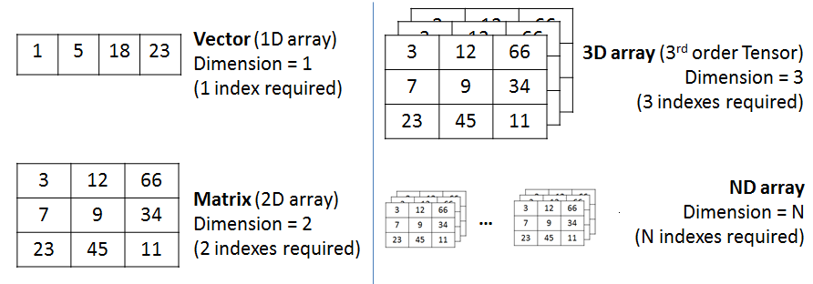

> Le type [ndarray](https://numpy.org/doc/stable/reference/generated/numpy.ndarray.html) est très similaire à une liste (`list`) mais ne peut contenir que des valeurs de même type. Le type [ndarray](https://numpy.org/doc/stable/reference/generated/numpy.ndarray.html) possède des avantages en terme de performance (vitesse et occupation mémoire). Il offre aussi beaucoup plus de fonctions.

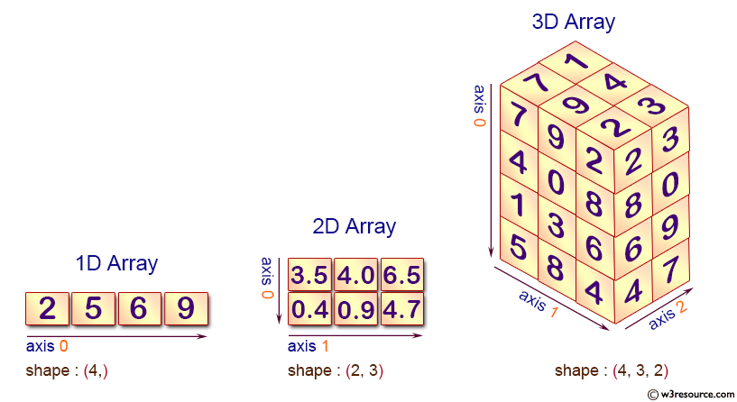

Exemple pour un tableau à 2 dimensions :

```python
import numpy as np

t = np.array([[1,2,3],[4,5,6],[7,8,9],[10,11,12]])
print(f'Tableau t : \n{t}')
print(f'Géométrie : {t.shape}')
print(f'3ème ligne : {t[2]}')
print(f'Le 2ème élément de sa 4ème ligne : {t[3, 1]}')
print(f'Les 2 derniers éléments des 2 dernières lignes  :\n {t[-2:, -2:]}')
print(f'La somme de ses éléments : {t.sum()}')
```

On obtient :

```sh
Tableau t :
[[ 1  2  3]
 [ 4  5  6]
 [ 7  8  9]
 [10 11 12]]
Géométrie : (4, 3)
3ème ligne : [7 8 9]
Le 2ème élément de sa 4ème ligne : 11
Les 2 derniers éléments des 2 dernières lignes  :
 [[ 8  9]
 [11 12]]
La somme de ses éléments : 78
```

Initialisation d’un _ndarray_ :

```python
>>> np.arange(10)
array([0, 1, 2, 3, 4, 5, 6, 7, 8, 9])

>>> np.linspace(0, 1, 5)
array([0.  , 0.25, 0.5 , 0.75, 1.  ])

>>> np.zeros( (2,5) )
array([[0., 0., 0., 0., 0.],
       [0., 0., 0., 0., 0.]])

>>> np.full((1, 3), 42)
array([[42, 42, 42]])
```

_Slicing_ :

Le _slicing_ va permettre d’extraire des éléments de structures de données séquentielles comme une liste, une chaîne de caractères ou un _ndarray_. L’opérateur de _slicing_ s’écrit sous la forme : `sequence[indice_de_depart_inclus:indice_de_fin_exclu:pas_de_saut]`. Si un des paramètres est omis, Python utilise ses valeurs par défaut.

Exemple :

```python
import numpy as np

# tableau à 1 dimension
n = np.arange(10)
print(n[2:5])   # [2, 3, 4]
print(n[:4])    # [0, 1, 2, 3]
print(n[5:])    # [5, 6, 7, 8, 9]
print(n[::2])   # [0, 2, 4, 6, 8] (un élément sur deux)

# tableau à 2 dimensions
t = np.array([[1,2,3],[4,5,6],[7,8,9],[10,11,12]])
print(f'Tableau t : \n{t}')
print(f'Les 2 premières lignes :\n{t[:2]}')
print(f'Les 2 dernières lignes :\n{t[-2:]}')
print(f'Les 2 premières colonnes :\n{t[:,:2]}')
print(f'Les 2 dernières colonnes :\n{t[:,-2:]}')
```

On obtient :

```sh
[2 3 4]
[0 1 2 3]
[5 6 7 8 9]
[0 2 4 6 8]

Tableau t :
[[ 1  2  3]
 [ 4  5  6]
 [ 7  8  9]
 [10 11 12]]
Les 2 premières lignes :
[[1 2 3]
 [4 5 6]]
Les 2 dernières lignes :
[[ 7  8  9]
 [10 11 12]]
Les 2 premières colonnes :
[[ 1  2]
 [ 4  5]
 [ 7  8]
 [10 11]]
Les 2 dernières colonnes :
[[ 2  3]
 [ 5  6]
 [ 8  9]
 [11 12]]
```

_Boolean indexing_ :

Le _slicing_ va permettre d’extraire des éléments de structures de données séquentielles (comme une liste, une chaîne de caractères ou un _ndarray_) en utilisant une expression booléenne.

> Avec le _boolean indexing_, la géométrie (_shape_) peut être modifiée.

Exemple :

```python
import numpy as np

t = np.array([[1,2,3],[4,5,6],[7,8,9],[10,11,12]])

print(f'Tableau t : \n{t}')

print(f'Les valeurs supérieures à 10 :\n{t[t > 10]}') # retourne un tableau à une seule dimension !

t[t > 10] = 0
print(f'Après avoir mis à 0 les valeurs supérieures à 10 :\n{t}')
```

On obtient :

```sh
Tableau t :
[[ 1  2  3]
 [ 4  5  6]
 [ 7  8  9]
 [10 11 12]]
Les valeurs supérieures à 10 :
[11 12]
Après avoir mis à 0 les valeurs supérieures à 10 :
[[ 1  2  3]
 [ 4  5  6]
 [ 7  8  9]
 [10  0  0]]
```

> Voir le module [NumPy](#numpy).

### Les matrices

En Python, les matrices peuvent être représentées par :

- des listes de listes

> Une liste est une collection ordonnée d'éléments (entiers, flottants, chaînes de caractères, ...) séparés par des virgules et mis entre crochets. Les listes sont de simples suites d’éléments indexés (à partir de 0 et les indices négatifs sont autorisés). Dans les listes, les éléments qui se suivent ne sont pas nécessairement de même type. Contrairement aux chaînes de caractères, les listes sont des séquences modifiables.

Par exemple, la matrice $A$ sera représentée par la liste de listes :

$${\displaystyle A={\begin{pmatrix}1&2&3 \\\ 4&5&6 \end{pmatrix}}}$$

```python
>>> A = [[1, 2, 3], [4, 5, 6]]
>>> print(type(A), A)
<class 'list'> [[1, 2, 3], [4, 5, 6]]
```

- le type [matrix](https://numpy.org/doc/stable/reference/generated/numpy.matrix.html) du module [numpy](https://numpy.org/doc/stable/index.html) :

```bash
$ pip install numpy
```

```python
>>> import numpy as np
>>> A = np.array([[1, 2, 3], [4, 5, 6]])
>>> print(type(A), A)
<class 'numpy.ndarray'> [[1 2 3]
 [4 5 6]]
>>> print(A.shape)
(2, 3)
```

> Le sous module [numpy.linalg](https://numpy.org/doc/stable/reference/routines.linalg.html#module-numpy.linalg) regroupent de nombreuses fonctions pour l’algèbre linéaire sur les matrices.

```python
#!/usr/bin/env python
# encoding: utf-8

# liste de listes
A = [[1, 2, 3], [4, 5, 6]]
print(type(A), A)

# type matrix de numpy
import numpy as np
import numpy.linalg as alg

A = np.array([[1, 2, 3], [4, 5, 6]])
print(type(A), A)
print(A.shape)

A = np.array([[3, 5], [6, 17]])
print("A =", A)
print(A.shape)
#print(A.size) # nb éléments

# parcourir une matrice
for ligne in A:
    for element in ligne:
        print(element)

print("Déterminant", alg.det(A))
print("Rang", alg.matrix_rank(A))
#print(A.ndim)

B = np.array([[1], [19]])
print("B =", B)

# produit matriciel
Y = np.dot(A, B)
print("Produit matriciel AB", Y)

print("Transposée")
print(np.transpose(A))
print(A.T)

# pour le chiffre de hill
comatrice = np.linalg.inv(A).T * alg.det(A)
print("Transposée de sa comatrice", comatrice.T)

print("multiplication par un scalaire")
A = np.array([[17, 21], [20, 3]])
B = 5*A
print("B = 5xA =", B)

# appliquer un modulo à chaque élément
def modulo(element):
    return element % 26

B = np.apply_along_axis(modulo, axis=1, arr=B)
print("B mod 26 =", B)
# conversion en entier
# np.round(B).astype(int)
```

> Voir le module [NumPy](#numpy).

### Autres conteneurs

Python propose un module `collections` avec d’autres objets conteneurs : `namedtuple`, `deque`, `Counter`, `OrderedDict`, `defaultdict`, `ChainMap`, `UserDict`, `UserList` et `UserString`.

Exemples :

- `OrderedDict` : des dictionnaires qui conservent l’ordre d’insertion

```python
import collections
#from collections import OrderedDict

d = collections.OrderedDict()
d['c'] = 1
d['b'] = 2
d['a'] = 3

# conserve l'ordre d'insertions
print(d.keys()) # ['c', 'b', 'a']
```

- `Counter` : un dictionnaire spécialisé pour le comptage

```python
import collections
#from collections import Counter
c = collections.Counter()
print(c['roger']) # 0
c['roger'] += 1
print(c['roger']) # 1
for i in range(0,5):
    c['robert'] += 1
    print(c['robert']) # 0 1 2 3 4 5

print(c) # Counter({'robert': 5, 'roger': 1})

# compte les occurences
print(collections.Counter('le soleil brille')) # Counter({'l': 5, 'e': 3, ' ': 2, 'i': 2, 'b': 1, 'o': 1, 's': 1, 'r': 1})
```

- `namedtuple` : des tuples nommés et structurés

```python
#from collections import namedtuple
Fiche = collections.namedtuple("Fiche", "nom prenom age")
f = Fiche(nom="Dupond", prenom="robert", age=66)
print(f) # Fiche(nom='Dupond', prenom='robert', age=66)
# toujours itérable :
for c in f:
    print c # Dupond robert 66

print(f.nom) # Dupond
```

- `deque` : des listes à double entrée, les objets de la liste peuvent ainsi être ajoutés ou retirés, soit à gauche soit à droite, et en temps constant

```python
#from collections import deque
d = collections.deque('ell')
for elem in d:
    print(elem.upper()) # E L L

d.append('o')
d.appendleft('h')
print(d) # deque(['h', 'e', 'l', 'l', 'o'])

d.pop()
print(d) # deque(['h', 'e', 'l', 'l'])
print(collections.deque(reversed(d))) # deque(['l', 'l', 'e', 'h'])
```

### Ramasse-miettes

Si créer des instances est simple, les détruire est encore plus simple. En général, il n’y a pas besoin de libérer explicitement les instances, elles sont libérées automatiquement lorsque les variables auxquelles elles sont assignées sont hors de portée. Sinon, le mot-clé `del` sert à supprimer explicitement une instance.

La technique du ramasse-miettes (_garbage collector_) Python est le « comptage de références » et lorsque ce compteur descend alors à 0, Python détruit l’instance automatiquement. En général, vous pouvez simplement ignorer la gestion mémoire et laisser Python nettoyer derrière vous car les fuites mémoire sont rares avec ce langage.

### Les fonctions

Python permet la programmation procédurale.

Déclaration et définition de fonctions :

Python dispose de fonctions comme la plupart des autres langages, mais il n’a pas de fichiers d’en-tête séparés comme C/C++.

Lorsque vous avez besoin d’une fonction, vous n’avez qu’à la déclarer et l’écrire (la définir).

```python
def foo(n):
    instruction(s)
    return resultat
```

Le mot clé `def` débute une déclaration de fonction, suivi du nom de la fonction, puis des arguments entre parenthèses (ici `n`). Les arguments multiples sont séparés par des virgules.

Les fonctions Python ne définissent pas le type de leur valeur de retour, elle ne spécifient même pas si elle retournent une valeur ou pas. En fait chaque fonction Python retournera une valeur, si la fonction exécute une instruction `return`, elle va en retourner la valeur, sinon elle retournera `None`, la valeur nulle en Python.

Les arguments ne spécifient pas de types de données. En Python, les variables ne sont jamais explicitement typées. En se basant sur la valeur que vous lui assignez, Python gère les types de données en interne.

Documentation des fonctions :

Vous pouvez documenter une fonction Python en lui donnant une chaîne de documentation (_doc string_).

```python
def foo(n):
    """Je suis une fonction qui reçoit un paramètre n.

    Je retourne un string."""

print foo.__doc__
```

Les tripes guillemets indiquent une chaîne multi-lignes.

Une _doc string_, si elle existe, doit être la première chose déclarée dans une fonction (la première chose après les deux points). Techniquement parlant, vous n’êtes pas obligés de donner une _doc string_ à votre fonction, mais vous devriez toujours le faire.

> Une fonction, comme tout le reste en Python, est un objet ! Qu’est-ce qu’un objet ? Chaque langage de programmation définit le terme « objet » à sa manière. En Python, tout est objet dans le sens où tout peut être assigné à une variable ou passé comme argument à une fonction.

Exemple :

Les fonctions Python n’ont pas de _begin_ ou _end_ explicites, ni d’accolades qui pourraient marquer là ou commence et ou se termine le code de la fonction. Le seul délimiteur est les deux points (`:`) et l’indentation du code lui-même.

```python
#!/usr/bin/python
# coding: utf-8

def reponse(x):
    """Affiche la réponse x"""
    print "La réponse est", x

t = "Hello"
i = 0

reponse(t) # La réponse est Hello
reponse(i) # La réponse est 0

def ratio(numerateur, denominateur=1):
    """Retourne le ratio n/d"""
    return numerateur/denominateur

print ratio(1, 2) # 0
print ratio(1., 2.) # 0.5
print ratio(5) # 5
```

> Comme tout langage à typage dynamique, il n’est pas possible d’effectuer une **surchage** de fonctions (ou de méthodes). Voir : [Comment effectuer une surcharge ?](https://python.developpez.com/faq/?page=Les-fonctions#Comment-effectuer-une-surcharge-de-fonctions-ou-polymorphisme-parametrique)

Python autorise les **paramétres par défaut** pour les fonctions :

```python
def foo(a=2):
    print a

foo()       # affiche 2
foo(12)     # affiche 12
foo(a=12)   # affiche 12
foo()       # affiche 2

def bar(a=[]):
    print a

bar()           # affiche []
bar([1,2,3,4])  # affiche [1, 2, 3, 4]
bar()           # affiche []
```

:warning: Attention, le paramètre par défaut est construit une fois pour toute quand la fonction est générée. Cela peut provoquer des effets de bord lorsque le paramètre est muable (_mutable_) :

```python
import random

def stuff(a=[]):
    a.append(random.randint(0,9))
    return a

print stuff()       # affiche [0]
print stuff()       # affiche [0, 8]
print stuff()       # affiche [0, 8, 8]
print stuff()       # affiche [0, 8, 8, 7]
print stuff([])     # affiche [9]
print stuff([5,1])  # affiche [5, 1, 6]
print stuff()       # affiche [0, 8, 8, 7, 1]
```

### Notions de référence

En fait, une variable est un nom (un label, un identifiant) pointant vers une **référence d’un objet**.

```python
a = 1
a = 2
```

:warning: Attention, `a` n’est pas un emplacement mémoire qui stocke la valeur `1` puis la valeur `2`. En Python, `a` est une référence à un objet avec la valeur `1`, puis est réaffecté en tant que référence à un objet avec la valeur `2` :

```python
a = 2
print "Référence de a : %d" % id(a) # Référence de a : 33956160
a = 1
print "Référence de a : %d" % id(a) # Référence de a : 33956184
b = a
print "Référence de b : %d" % id(b) # Référence de b : 33956184
b = 3
print "Référence de b : %d" % id(b) # Référence de b : 33956136
```

Lorsqu’on a affecté `a` à `b` (`b = a`), on a copié la valeur de la référence de `a` dans `b` (à ce moment là, `a` et `b` ont la même référence). Ici, les valeurs `1`, `2` et `3` sont des « objets » différents et les références ne sont donc pas les mêmes.

Idem pour une liste :

```python
liste1 = [1, 2, 3]
print "Référence de liste1 : %d" % id(liste1) # Référence de liste1 : 140042289226384
liste2 = liste1
print "Référence de liste2 : %d" % id(liste2) # Référence de liste2 : 140042289226384
liste2.append(4)
print(liste2)                                 # [1, 2, 3, 4]
print(liste1)                                 # [1, 2, 3, 4]
print "Référence de liste1 : %d" % id(liste1) # Référence de liste1 : 140042289226384
print "Référence de liste2 : %d" % id(liste2) # Référence de liste2 : 140042289226384
print liste1 is liste2                        # True
```

Mais ici, `liste1` et `liste2` ont la même référence car il n’y a qu’un seul objet (mais deux identifiants `liste1` et `liste2` qui ont la même valeur de référence).

C’est ce mécanisme qui est utilisé quand on passe des arguments à une fonction : Il y un **passage de référence** (par valeur) des paramètres de la fonction. C’est la valeur de la référence qui est copiée.

```python
def ajouter(l, a):
    print "Référence de liste : %d" % id(liste) # Référence de liste : 140660673366712
    l.append(a)

liste = [1,2,3,4]
print "Référence de liste : %d" % id(liste)     # Référence de liste : 140660673366712
print(liste)                                    # [1, 2, 3, 4]
ajouter(liste,5)
print(liste)                                    # [1, 2, 3, 4, 5]
print "Référence de liste : %d" % id(liste)     # Référence de liste : 140660673366712
```

Évidemment, cela dépendra si l’objet passé en argument est _mutable_ ou non.

### Gestion des exceptions

Python permet la gestion des exceptions afin de faciliter la mise en oeuvre de code robuste.

> cf les [exceptions en Python3](https://docs.python.org/3/library/exceptions.html).

Une exception est l’interruption de l’exécution du programme à la suite d’un événement particulier (c’est-à-dire exceptionnel !) et le transfert du contrôle à des fonctions spéciales appelées gestionnaires.

```python
def ratio(num, den):
    return num/den

print ratio(1., 2.) # affiche 0.5

# le programme s'arrête et lève une exception :
print ratio(1, 0) # lève une exception ZeroDivisionError
print ratio("1", "2") # lève une exception TypeError
print ratio(1., i) # lève une exception NameError
```

La gestion d’une exception est découpée en plusieurs parties distinctes :

- le déclenchement : `raise` (lance ou lève une exception)
- le traitement (inspection et capture) : instructions inséparables `try` et `except`
- la gestion peut être complétée par deux autres mots clés : `finally` (un bloc qui est exécuté après que tous les autres blocs aient été exécutés) et `else` (bloc exécuté si aucune exception n’est levée).

Forme minimaliste :

```python
try:
    # instructions pouvant provoquer une exception
except: # attrape toutes les exceptions
    # instruction(s) exécutée(s) en cas d'exception
```

Forme complète :

```python
try:
    # instructions pouvant provoquer une exception
except: # attrape toutes les exceptions
    # instruction(s) exécutée(s) en cas d'exception
else:
    # instruction(s) exécutée(s) si aucune exception n'est levée
finally:
    # instruction(s) toujours exécutée(s) à la fin
```

Il est possible et conseillé de préciser le type d’exception après le mot clé `except` :

```python
ingredients = ['lait', 'farine', 'sucre', 'sel']

try:
    # si i est plus grand que la taille du tableau
    i = 4
    ingredient = ingredients[i]
except IndexError:
    ingredient = None

print ingredient # affiche None
```

Ou d’en indiquer plusieurs :

```python
ingredients = ['lait', 'farine', 'sucre', 'sel']

try:
    # si i n'est pas un type entier
    i = "0"
    ingredient = ingredients[i]
except (IndexError,TypeError):
    ingredient = None

print ingredient # affiche None
```

Lever une exception :

```python
def truc(a):
    if a == 0 :
        raise ValueError("a ne peut être égal à zéro")
    print a

try:
    truc(1)
    truc(-1)
    truc(0) # lève une exception ValueError
except ValueError as e:
    print e # a ne peut être égal à zéro
```

On peut aussi relancer une exception :

```python
def ratio(num, den):
    try:
        if den == 0:
            raise ZeroDivisionError("Le dénominateur ne peut être égal à zéro")
    except ZeroDivisionError:
            raise # on relance l'exception
    else:
        return num/den

try:
    print ratio(1., 2.) # affiche 0.5
    print ratio(1, 0) # lève l'exception ZeroDivisionError
except Exception as e:
    print(e) # affiche "Le dénominateur ne peut être égal à zéro"
```

> Il est possible de créer ses propres (classes d’) exceptions en héritant de la classe `Exception`.

### Les assertions

Les **assertions** sont un moyen simple de s’assurer, avant de continuer, qu’une condition est respectée. On utilise le mot clé `assert` : `assert condition` si `condition` est égale à `True`, l’exécution se poursuit normalement sinon, une exception `AssertionError` est levée :

```python
#!/usr/bin/python
# coding: utf-8

def ratio(num, den):
    try:
        assert den != 0
    except AssertionError:
        return None
    else:
        return num/den

print ratio(1., 2.) # affiche 0.5
print ratio(1, 0) # affiche None
```

> Les **assertions** sont le fondement des [tests unitaires](https://fr.wikipedia.org/wiki/Test_unitaire) en programmation informatique.

### Classes et Objets (POO)

Une classe se définit avec le mot-clé `class`.

> Python oblige de déclarer l'instance de l'objet courant, conventionnellement nommée `self`, comme premier argument des méthodes, et à chaque fois que l'on souhaite accéder à une donnée de cette instance dans le corps de cette méthode.

La méthode `__init__` permet d'initialiser une instance, elle est appelé automatiquement lorsqu'un objet a été créé. Il existe aussi `__new__` qui est appelé avant la création de l'objet.

```python
class Vehicule:
    """La classe Vehicule"""

    # un attribut
    couleur = ""

    # des méthodes
    def __init__(self, couleur="blanche"):
        self.couleur = couleur

    def avance(self):
        """La méthode avance()"""
        print "j'avance"

    def tourne(self):
        """La méthode tourne()"""
        print "je tourne"

    # une fonction spéciale
    def __repr__(self):
        """ L'affichage de l'objet dans l'interpréteur """
        return "Vehicule(couleur=\'" + self.couleur + "\')"

v1 = Vehicule()
v1.avance() # j'avance

# affiche le nom de la classe :
print v1.__class__.__name__ # Vehicule

# et son type :
print type(v1) # <type 'instance'>

print v1 # Vehicule(couleur='blanche')
```

> Le langage Python a un support très limité de l'**encapsulation**. Il n'y a pas, comme en Java ou C++ par exemple, de contrôle de l'accessibilité par des mots clefs comme `protected` ou `private`.

Les variables d'instance "privées" (`private`) auxquelles on ne peut accéder qu'à l'intérieur d'un objet n'existent donc pas en Python. Cependant, il existe une convention en Python :

- un nom précédé d'un _underscore_ (par exemple `_b`) doit être traité comme un membre non publique (qu'il s'agisse d'une fonction, d'une méthode ou d'un attribut).
- un nom précédé de deux _underscore_ (par exemple `__c`) sera textuellement remplacé par `_classname__c`, où `classname` est le nom de classe actuel (pour éviter les conflits de noms avec ceux définis par des sous-classes). Ceci fait que l'accès `monObjet.__c` provoquera une exception de type `AttributeError` et pourrait faire croire à une encapsulation privée ce qui n'est pas le cas).

> Le slogan des développeurs Python est « _we're all consenting adults here_ » (nous sommes entre adultes consentants) et qu'une simple convention suffira pour préciser les responsabilités (Source : [fr.wikipedia.org](https://fr.wikipedia.org/wiki/Python_(langage))).

Exemple :

```python
class MaClasse:
    def __init__(self):
       # trois attributs :
       self.a = 1
       self._b = 2
       self.__c = 3

monObjet = MaClasse()

# affiche les attributs d'un instance :
print(vars(monObjet)) # {'a': 1, '_MaClasse__c': 3, '_b': 2}

# donc :
print(monObjet.a) # {'a': 1, '_MaClasse__c': 3, '_b': 2}
print(monObjet._b) # {'a': 1, '_MaClasse__c': 3, '_b': 2}
print(monObjet._MaClasse__c) # {'a': 1, '_MaClasse__c': 3, '_b': 2}

# mais :
print(monObjet.__c) # AttributeError: MaClasse instance has no attribute '__c'
```

Ensuite, le mécanisme des propriétés (`property`) permettra d'implémenter des accesseurs/mutateurs (_getter/setter_) : [Manipuler les attributs](#manipuler-les-attributs).

Python reconnaît trois types de méthodes :

- les méthodes d'instance, qui sont celles définies par défaut. Elles reçoivent comme premier argument une instance de la classe où elles ont été définies.
- les méthodes de classe, qui reçoivent comme premier argument la classe où elles ont été définies. Elles peuvent être appelées depuis une instance ou directement depuis la classe. Elles sont déclarées avec le décorateur `@classmethod`.
- les méthodes statiques, qui ne reçoivent pas de premier argument implicite. Elles sont similaires aux méthodes statiques que l'on trouve en Java ou C++. Elles sont déclarées avec le décorateur `@staticmethod`.

> Comme tout langage à typage dynamique, il n'est pas possible d'effectuer une surchage de fonctions ou de méthodes. Voir : [Comment effectuer une surcharge ?](https://python.developpez.com/faq/?page=Les-fonctions#Comment-effectuer-une-surcharge-de-fonctions-ou-polymorphisme-parametrique)

Python fournit un mécanisme pour définir un ensemble pré-défini d'opérateurs : tout objet Python peut se voir doté de méthodes dites spéciales.

Ces méthodes, commençant et finissant par deux tirets de soulignement (_underscores_), sont appelées lors de l'utilisation d'un opérateur sur l'objet : + (méthode `__add__`), += (méthode `__iadd__`), [] (méthode `__getitem__`), () (méthode `__call__`), etc. Des méthodes comme `__repr__` et `__str__` permettent de définir la représentation d'un objet dans l'interpréteur interactif et son rendu avec la fonction `print`. Il existe aussi : `__new__` et `__del__`.

```python
class Temps:
    def __init__(self, heure=0, minute=0, seconde=0):
        self.valeur = (heure*3600)+(minute*60)+seconde

    def __add__(self, a):
        temps = Temps()
        if type(a) == int:
            temps.valeur = self.valeur + a
        elif isinstance(a, Temps):
            temps.valeur = self.valeur + a.valeur
        else: raise AttributeError, "aucun traitement pour le type " + str(type(a))
        return temps

    def __radd__(self, o):
        return self + o

    def __str__(self):
        return "{0:02}:{1:02}:{2:02}".format((self.valeur/3600), (self.valeur%3600)/60, (self.valeur%60))


t1 = Temps()
print("t1 = %s" % t1) # t1 = 00:00:00

t2 = Temps(1, 60, 30)
print("t2 = %s" % t2) # t2 = 02:00:30

# appel __add__ :
t1 = t2 + 10
print("t1 = %s" % t1) # t1 = 02:00:40

# appel _radd__ :
t1 = 20 + t2
print("t1 = %s" % t1) # t1 = 02:00:50

t1 = t1 + t2
print("t1 = %s" % t1) # t1 = 04:01:20
```

Python supporte l'**héritage** (et l'héritage multiple).

```python
class Voiture(Vehicule):
    """La classe Voiture"""

    def __init__(self, couleur="", model=""):
        Vehicule.__init__(self, couleur)
        # attributs
        self.model = model

    def afficherModel(self):
        print self.model

    def tourne(self):
        Vehicule.tourne(self)
        print "mais en douceur !"

v2 = Voiture("rouge", "306")
v2.afficherModel() # 306
v2.avance() # j'avance
v2.tourne() # je tourne mais en douceur !

# il faudrait redéfinir __repr__
print v2 # Vehicule(couleur='rouge')

setattr(v2, "model", "206")
print getattr(v2, "model")
v2.afficherModel() # 206

v3 = Voiture()
# il faudrait redéfinir __repr__
print v3 # Vehicule(couleur='')
```

Il existe plusieurs techniques pour manipuler les attibuts autrement que directement :

```python
v2.model = "406"
print(v2.model) # 406
v2.afficherModel() # 406
```

Il est possible de lire ou de modifier un attribut dynamiquement avec les fonctions `getattr()` et `setattr()`.

```python
v2 = Voiture("rouge", "306")

setattr(v2, "model", "206")
print getattr(v2, "model") # 206
v2.afficherModel() # 206
```

Il est aussi possible de passer par des _getter_ (accesseur) et des _setter_ (mutateurs). Il faut que la classe hérite de `object` et que l'attribut soit préfixé par un _underscore_ ou encore mieux deux _underscore_.

Il y a deux écriture possibles :

- soit en passant par `property`
- soit en utilisant `@property`

Exemple de _getter_ (accesseur) et des _setter_ (mutateur) :

```python
# Version 1
class Personne(object):

    def __init__(self, nom=""):
        # un atribut pseudo privé :
        self.__nom = nom

    @property
    def nom(self):
        print "accesseur de nom"
        return self.__nom

    @nom.setter
    def nom(self, nom):
        print "mutateur de nom"
        self.__nom = nom

    @nom.deleter
    def nom(self):
        del self.__nom

p = Personne("Dupond")

# appel mutateur (setter) :
p.nom = "Durand"

# appel accesseur (getter) :
print(p.nom)

# ou :

# Version 2
class Personne(object):

    def __init__(self, nom=""):
        # un atribut pseudo privé :
        self.__nom = nom

    def getNom(self):
        print "accesseur de nom"
        return self.__nom

    def setNom(self, nom):
        print "mutateur de nom"
        self.__nom = nom

    def delNom(self):
        del self.__nom

    #nom = property(getNom, setNom)
    nom = property(getNom, setNom, delNom, "Je suis la propriété nom.")

p = Personne("Dupond")

# appel mutateur (setter) :
p.nom = "Durand"

# appel accesseur (getter) :
print(p.nom)
```

### Les modules et les packages

Python permet la programmation modulaire.

Les modules sous Python sont des fichiers (`.py`) qui regroupent des ensembles de fonctions et/ou de classes.

Pour utiliser des modules dans un programme, il faut utiliser l'instructions `import` :

```python
import math

print math.sqrt(4)

# ou en créant un alias :

import math as m

print m.sqrt(4) # 2.0
```

On peut aussi utiliser `from` mais cela est déconseillé pour des risques de conflits de noms :

```python
from math import *

print sqrt(4) # 2.0
```

Il existe de nombreux modules standards dont : `cgi`, `math`, `os`, `pickle`, `random`, `re`, `socket`, `sys`, `time`, `urllib`, ...

Il est évidemment possible de créer ses propres modules. Par exemple, un fichier `fonctions.py` qui contient les fonctions `reponse` et `ratio` vues précédemment.

Pour cela, il faut :

- soit que le module existe sous la forme d'un fichier `.py` situé dans le même dossier que le fichier qui l'importe. Donc :

```python
import fonctions

print fonctions.ratio(1.,2.)  # 0.5
```

- soit qu'il soit dans un autre répertoire du programme et le module sera importé à partir du nom du répertoire.

Dans ce cas, Il faudra :

- soit créer un fichier `__init__.py` qui assurera l'importation de tous les fichiers que le répertoire contient :

```python
from fonctions import *
```

Puis, on importe le module `lib` (qui est le nom du répertoire qui contient le fichier `fonctions.py`) :

```python
import lib

print lib.ratio(1.,2.)  # 0.5
```

- soit modifier dynamiquement la liste des chemins en ajoutant les répertoires supplémentaires qui contiennent des modules à importer :

```python
import sys
sys.path.append("monchemin")

import fonctions

print fonctions.ratio(1.,2.)  # 0.5
```

Il est donc possible de regrouper des modules dans des **_packages_**. Comme pour d'autres langages, un _package_ est tout simplement un répertoire. Ce répertoire pourra contenir d'autres répertoires (des _packages_) et des fichiers (des modules).

> Lors de l'importation d'un module, le programme va tout d'abord vérifier si le module à importer se trouve dans le dictionnaire `sys.modules` (module de base + les modules d'autres bibliothèques que vous avez installées). Si le module n'est pas trouvé, le programme le cherchera à partir de la liste définie par `sys.path` (qui contient le répertoire courant, la variable d'environnement `PYTHONPATH` entre autres).

Au moment d'importer le module, Python va lire (ou créer si il n'existe pas) un fichier `.pyc` (à partir de la version 3.2, ce fichier se trouve dans un dossier `__pycache__`). Ce fichier est généré par Python et contient du code compilé du module.

### `__main__`

Si vous voulez ajouter du code  au sein d'un module pour le tester par exemple, il sera utile de procéder ainsi :

```python
#!/usr/bin/python
# coding: utf-8

def ratio(numerateur, denominateur=1):
    """Retourne le ratio n/d"""
    return numerateur/denominateur

if __name__ == "__main__":
    print ratio(1., 2.)   # 0.5
```

Les modules sont des objets et tous les modules disposent de l'attribut prédéfini `__name__`.

Le `__name__` d'un module dépend de la façon dont vous l'utilisez. Si vous importez le module, son `__name__` est le nom de fichier du module sans le chemin d'accès ni le suffixe.

Mais vous pouvez aussi lancer le module directement en tant que programme, dans ce cas `__name__` va prendre par défaut une valeur spéciale `__main__`.

### `__debug__`

L'exécution des scripts avec l'interpréteur `python3` sont réalisés en mode _debug_ **par défaut**. Pour le désactiver, il faut exécuter le script avec l'option `-O` soit par exemple `python3 -O script.py` pour supprimer les déclarations `assert` et tout code conditionnel à la valeur de `__debug__` :

```python
...

# affichage en mode debug seulement
if __debug__:
    print("par défaut")
else:
    print("Option -O")
```

On obtient :

```sh
$ python3 script.py
__debug__ =  True
par défaut

$ python3 -O script.py
__debug__ =  False
Option -O
```

### Les fichiers

Pour lire le contenu d'un fichier, il faudra tout d'abord l'ouvrir (`open()`) puis le lire (`read()` qui retourne une chaîne de caractères ou `readlines()` qui retourne une liste de chaînes de caractères) et pour finir le fermer (`close()`) :

```python
fichier = open('/etc/passwd','rb') # Ouverture du fichier en mode lecture
lignes = fichier.readlines() # Récupération du contenu du fichier

# Traitement ligne par ligne
for ligne in lignes:
    sp = ligne.split('#')[0] # Élimination des commentaires potentiels  
    sp = sp.split(':') # Séparation
    #print sp
    print "Utilisateur : " +  sp[0] + " - UID : " + sp[2]

fichier.close() # Fermeture du fichier
```

> Voir aussi la méthode `seek()` pour se déplacer dans un fichier.

Pour écrire dans un fichier, il suffit del'ouvrir (`open()`) puis d'écrire (`write()` pour une chaîne de caractères ou `writelines()` pour une liste de chaînes de caractères) et pour finir le fermer (`close()`) :

```python
fichier = open('essai.txt','w') # Ouverture du fichier en mode écriture (avec écrasement)

fichier.write("hello world !") # Écriture d'un contenu dans le fichier

fichier.close() # Fermeture du fichier
```

> Voir aussi le module `pickle` pour enregistrer des objets dans des fichiers.

Les méthodes `open()` et `close()` ne sont pas obligatoires :

```python
fichier = file('essai.txt','r')

print fichier.read()
```

Pour récupérer la liste des fichiers d'un répertoire :

- `os.listdir(path)` retourne une liste contenant les noms de tous les fichiers et répertoires de _path_
- ou `glob.glob(path)` qui renvoie une liste contenant le chemin complet des fichiers ou répertoires contenus dans _path_

```python
import glob
import os.path

fichiers=[]
repertoire = glob.glob('./*')
for i in repertoire:
    if os.path.isfile(i):
        fichiers.append(i)

print fichiers
```

> Voir aussi : `os.path.getsize()` qui retourne la taille d'un fichier, `os.remove()` pour supprimer , `os.rename()` pour renommer , `os.move()` pour déplacer, `os.chdir()` pour changer de répertoire courant, ... et le module `ftplib` pour dialoguer avec un serveur FTP.

Pour exécuter une commande, on fera :

```python
import os

os.system("ls");
```

> Voir aussi : les foncions du module `os`

Pour récupérer le résultat d'une commande, on fera :

```python
import os

commande = os.popen('ls ./', 'r') # comme pour les fichiers, 'r' ou 'w'

print commande.read() # les mêmes méthodes qu'un fichier
```

> Voir aussi : `Popen` de `subprocess`

### Les expressions régulières

Python dispose d'un module `re` qui permet de manipuler des expressions rationnelles (_regular expression_).

Une expression rationnelle est une suite de caractères qu'on appelle plus simplement motif (_pattern_) pour trouver une correspondance (_match_). On les utilise dans le cadre d'une recherche ou d'un remplacement de texte. Les mécanismes de base pour former un motif sont basés sur des caractères spéciaux de substitution, de groupement et de quantification.

> Lire : [fr.wikipedia.org](https://fr.wikipedia.org/wiki/Expression_régulière)

Exemple : un fichier texte contenant des numéros de téléphone

```txt
MARIE 04-91-85-96-34
ODILE 04-91-56-92-35
ALAIN 04-42-46-87-12
```

Utilisation de la fonction `findall()` :

```python
#!/usr/bin/python
# coding: utf-8

import re

fichier = open('./numtel','rb') # Ouverture du fichier en mode lecture 
lignes = fichier.readlines() # Récupération du contenu du fichier 

regexp = r"((0[1-9])((-[0-9]{2}){4}))"

## Traitement ligne par ligne
for ligne in lignes:
    print ligne
    print re.findall(regexp, ligne)
```

Utilisation de la fonction `match()` :

```python
#!/usr/bin/python
# coding: utf-8

import re

fichier = open('./numtel','rb') # Ouverture du fichier en mode lecture 
lignes = fichier.readlines() # Récupération du contenu du fichier 

regexp = r"((0[1-9])((-[0-9]{2}){4}))"

## Traitement ligne par ligne
for ligne in lignes:
    #print ligne
    sp = ligne.split(' ') # Séparation

    if re.match(regexp, sp[1]) is not None:
        print "Nom : " +  sp[0] + " - Tél : " + sp[1]
    else:
        print "Numéro téléphone non trouvé !"
```

Utilisation de la fonction `compile()` :

```python
#!/usr/bin/python
# coding: utf-8

import re

fichier = open('./numtel','rb') # Ouverture du fichier en mode lecture
lignes = fichier.readlines() # Récupération du contenu du fichier

regexp = r"((0[1-9])((-[0-9]{2}){4}))"
regex = re.compile(regexp)

## Traitement ligne par ligne
for ligne in lignes:
    #print ligne
    sp = ligne.split(' ') # Séparation

    if regex.match(sp[1]) is not None:
        print "Nom : " +  sp[0] + " - Tél : " + sp[1]
    else:
        print "Numéro téléphone non trouvé !"
```

Utilisation de la fonction `search()` :

```python
#!/usr/bin/python
# coding: utf-8

import re

fichier = open('./numtel','rb') # Ouverture du fichier en mode lecture
lignes = fichier.readlines() # Récupération du contenu du fichier

regexp = r"((0[1-9])((-[0-9]{2}){4}))"

## Traitement ligne par ligne
for ligne in lignes:
    #print ligne
    sp = ligne.split(' ') # Séparation

    print re.search(regexp, sp[1]).groups()
```

Utilisation de la fonction `search()` en donnant des noms à des groupes :

```python
#!/usr/bin/python
# coding: utf-8

import re

fichier = open('./numtel','rb') # Ouverture du fichier en mode lecture
lignes = fichier.readlines() # Récupération du contenu du fichier

regexp = r"((0[1-9])((-[0-9]{2}){4}))"

## Traitement ligne par ligne
for ligne in lignes:
    #print ligne
    sp = ligne.split(' ') # Séparation

    m = re.search(r"(?P<numero>(?P<indicatif>0[1-9])((-[0-9]{2}){4}))", sp[1])
    print m.group('numero')
    print m.group('indicatif')
```

Utilisation de la fonction `sub()` pour remplacer le format `0X-XX-XX-XX-XX` en `0X XX XX XX XX` :

```python
#!/usr/bin/python
# coding: utf-8

import re

fichier = open('./numtel','rb') # Ouverture du fichier en mode lecture
lignes = fichier.readlines() # Récupération du contenu du fichier

regexp = r"((0[1-9])((-[0-9]{2}){4}))"

## Traitement ligne par ligne
for ligne in lignes:
    #print ligne
    sp = ligne.split(' ') # Séparation

    print re.sub(r"([0-9]{2})-([0-9]{2})-([0-9]{2})-([0-9]{2})-([0-9]{2})", r"\1 \2 \3 \4 \5", sp[1])
```

## Programmer en Python

Cette partie présente les éléments essentiels à connaître pour programmer en Python.

### Ubuntu

Programmer en Python sous Ubuntu : https://doc.ubuntu-fr.org/python

> Par défaut, Python est installé sur GNU/Linux. Sinon, il faut au moins : `$ sudo apt install python python3-pip python3-venv`

Version de Python :

```sh
$ python3 --version
Python 3.6.8
```

Il est possible de programmer directement dans l’interpréteur Python en mode CLI :

- Python 2 :

```sh
$ python
Python 2.7.15+ (default, Oct 72019, 17:39:04)
[GCC 7.4.0] on linux2
Type "help", "copyright", "credits" or "license" for more information.
>>> a = 1
>>> print a
1
>>> exit()
```

- Python 3 :

```sh
$ python
Python 3.10.12 (main, May 27 2025, 17:12:29) [GCC 11.4.0] on linux
Type "help", "copyright", "credits" or "license" for more information.
>>> a = 1
>>> print a
  File "<stdin>", line 1
    print a
    ^^^^^^^
SyntaxError: Missing parentheses in call to 'print'. Did you mean print(...)?
>>> print(a)
1
>>> exit()
```

Un script d'exemple `helloworld.py` :

```python
#!/usr/bin/env python3
# coding: utf-8

# un commentaire : mon premier programme Python !

import sys

print(sys.version)
print()

# saisie d'une chaîne de caractères
langue = input("Quelle est votre langue ? (fr, ...)")

# une instruction conditionnelle
if langue == "fr" :
    message = "Bonjour le monde"
else :
    message = "Hello world"

# voir aussi : if ... elif ... else

# saisie d'un entier
nb = int(input("Donnez un nombre : "))
i = 0

# une boucle
while i < nb:
    #print(message)
    print(message, i + 1, " fois")
    i += 1

```

> La première ligne sert à préciser le chemin de l’interpréteur précédé des caractères `#!` (le _shebang_) qui exécutera le script. Cette ligne est inutile dans le cas d’une programmation web.

Il existe plusieurs manières d’exécuter un script Python de façon locale (mode CLI) :

- le rendre exécutable :

```sh
$ chmod +x helloworld.py
$ ./helloworld.py
```

- utiliser l’interpréteur Python :

```sh
$ python3 helloworld.py
```

### Windows

> Téléchargement pour Windows: https://www.python.org/downloads/windows/

Documentation : https://docs.python.org/fr/3/using/windows.html

### Visual Studio Code (VSCode)

[Visual Studio Code](https://code.visualstudio.com/) est un éditeur de code extensible développé par Microsoft pour Windows, Linux et macOS.

C’est un éditeur de code multi-plateforme, open source et gratuit, supportant une dizaine de langages (C/C++, Java, PHP, Python, Javascript, …).

Il existe de nombreuses extensions pour le langage Python :

- [Python](https://marketplace.visualstudio.com/items?itemName=ms-python.python)
- [Code Runner](https://marketplace.visualstudio.com/items?itemName=formulahendry.code-runner)
- [Python Indent](https://marketplace.visualstudio.com/items?itemName=KevinRose.vsc-python-indent)
- [Python Debugger](https://marketplace.visualstudio.com/items?itemName=ms-python.debugpy)
- [Python C++ Debugger](https://marketplace.visualstudio.com/items?itemName=benjamin-simmonds.pythoncpp-debug)
- [Pylance](https://marketplace.visualstudio.com/items?itemName=ms-python.vscode-pylance)
- [autoDocstring - Python Docstring Generator](https://marketplace.visualstudio.com/items?itemName=njpwerner.autodocstring)
- [Python Extended](https://marketplace.visualstudio.com/items?itemName=tushortz.python-extended-snippets)
- ...

### Environnement virtuel

Il n'est pas toujours possible, pour une installation unique de Python, de couvrir tous les besoins de toutes les applications.

La solution est de créer un [environnement virtuel](https://docs.python.org/fr/3/tutorial/venv.html) qui contient une installation de Python pour une version particulière ainsi que des paquets additionnels.

Python fournit le module [venv](https://docs.python.org/3/library/venv.html) pour créer et gérer des environnements virtuels.

Un environnement virtuel est un espace isolé qui contient son propre interpréteur Python et ses propres paquets (bibliothèques et modules).

Créer un environnement virtuel :

```sh
$ python -m venv <mon_environnement_virtuel>
```

Et pour activer un environnement virtuel sur Windows Mac, les OS bases sur UNIX :

```sh
# Sur Windows :
source chemin_vers_mon_environnement_virtuel\Scripts\activate

# Sur Mac ou Linux :
source chemin_vers_mon_environnement_virtuel/bin/activate
```

Désactiver un environnement virtuel :

```sh
deactivate
```

> Si beoin, supprimer définitivement l'environnement virtuel : `rm -rf chemin_vers_mon_environnement_virtuel`

Il existe des alternatives à [venv](https://docs.python.org/3/library/venv.html) comme [virtualenv](), [pipenv](https://packaging.python.org/en/latest/tutorials/managing-dependencies/) ou [Anaconda](https://anaconda.org/).

[virtualenv](https://virtualenv.pypa.io/en/latest/) est une sur-couche au module [venv](https://docs.python.org/3/library/venv.html).

Installation :

```sh
# via pip
$ pip install virtualenv

# via apt
$ apt install python-virtualenv

$ virtualenv -h
...
```

Créer un environnement virtuel :

```sh
$ virtualenv <mon_environnement_virtuel>
```

> Identique à la commande `python -m venv <mon_environnement_virtuel>`

[Conda](https://docs.conda.io/) est un système de gestion de paquets open source et un système de gestion d'environnement permettant d'installer plusieurs versions de paquets logiciels et leurs dépendances, et de passer facilement de l'une à l'autre. Il fonctionne sous Linux, OS X et Windows.

Liens :

- Installation : https://docs.conda.io/projects/conda/en/latest/user-guide/install/index.html
- Documentation : https://docs.conda.io/projects/conda/en/latest/index.html

Dans VSCode, avec la palette de commandes (Ctrl-Shift-P) :

- Sélectionner un interpréteur :

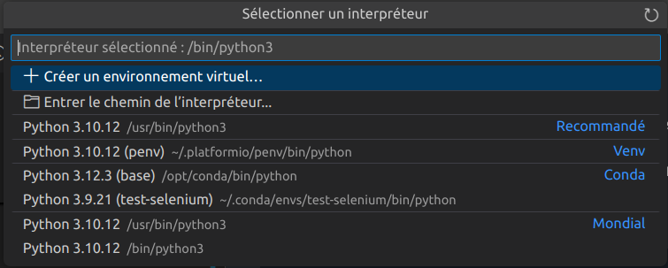

- Créer un environnement virtuel :

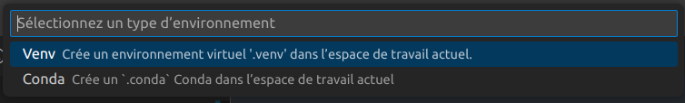

### Guide des bonnes pratiques

Le Zen de Python est un ensemble de 19 principes qui influencent le design du langage de programmation Python, et sont utiles pour comprendre et utiliser le langage : https://fr.wikipedia.org/wiki/Zen_de_Python

[PEP](https://fr.wikipedia.org/wiki/Python_(langage)#Les_PEP) 8 (_Python Enhancement Proposal_ 8) est un guide des directives et des meilleures pratiques pour écrire du code Python.

PEP 8 recommande d’utiliser des mots en minuscules séparés par des traits de soulignement `_` pour nommer les fonctions. C'est donc la convention [snake_case](https://bts-lasalle-avignon-tp.github.io/guides-developpement-logiciel/guide-programmation-btssn.html#_snake_case) qui s'applique.

On peut utiliser « `_` » dans le nom des variables et les fonctions mais pas « `-` ». On fera de même pour les noms de fichiers.

### Bac à sable et développement en ligne

Il est souvent nécessaire de passer par un "bac à sable".

> En informatique, le bac à sable (_sandbox_) est une zone d'essai permettant d'exécuter des programmes en phase de test ou dans lesquels la confiance est incertaine. C'est notamment très utilisé en sécurité informatique pour sa notion d'isolation.

Il existe de nombreux sites web qui fournissent des EDI (Environnement de Développement Intégré) en ligne pour tester du code ou des services : un espace d'apprentissage séparé. Ils permettent aussi d'échanger des exemples.

Quelques sites :

- basthon : https://basthon.fr/
- https://www.tutorialspoint.com/execute_python3_online.php
- https://python-fiddle.com/
- Try It Online : https://tio.run/#python3
- Et aussi Visual Studio Code Online : https://vscode.dev/

## Gestionnaire de paquet pip

[pip](https://pip.pypa.io/) est un gestionnaire de paquets utilisé pour installer et gérer des paquets écrits en Python. De nombreux paquets peuvent être trouvés sur le dépôt [Python Package Index](https://pypi.org/).

Lien : https://pip.pypa.io/

Version :

```sh
$ python -m pip --version
```

Installer un paquet :

```sh
$ pip install nom-du-paquet                      # dernière version
# ou :
$ python -m pip install nom-du-paquet            # dernière version
$ python -m pip install nom-du-paquet==1.0.4     # version spécifique
$ python -m pip install 'nom-du-paquet>=1.0.4'   # version minimum
```

> L'option `--upgrade` permet de faire une mise à jour.

Voir les détails d'un paquet installé : `pip show nom-du-paquet`

Rechercher un paquet : `pip search "requete"`

Désinstaller un paquet : `pip uninstall nom-du-paquet`

pip propose une fonctionnalité permettant de gérer des listes de paquets ainsi que leurs numéros de version, au travers d'un fichier de prérequis `requirements.txt`. Ceci permet de recréer efficacement un groupe entier de paquets sur un nouvel environnement ou un nouvel environnement virtuel.

```sh
$ pip install -r requirements.txt
```

Le fichier `requirements.txt` peut être généré avec la commande suivante :

```sh
$ python -m pip list # lister les paquets installés
$ python -m pip freeze > requirements.txt
```

> `pip list --outdated` permet de voir si une nouvelle version est disponible

## Modules

Cette partie présente les principaux modules Python utilisés lors des séances de Co-enseignement de Mathématiques et Sciences Physiques (BTS CIEL).

> Voir aussi : https://www.tresfacile.net/top-75-meilleurs-modules-et-bibliotheques-python/

Importer un module :

```python
import numpy
```

Importer un module en lui donnant un alias :

```python
import numpy as np
```

Importer une fonction d'un module :

```python
from scipy.stats import linregress
```

Importer toutes les fonctions d'un module :

```python
from math import *
```

> Certaines fonctions portent le même nom dans des bibliothèques différentes. Il est donc préférable de ne pas utiliser `from <module> import *` mais plutôt `import <module>`.

Lister toutes les fonctions (méthodes) d’un module Python :

```python
>>> import math
>>> print(dir(math))
['__doc__', '__loader__', '__name__', '__package__', '__spec__', 'acos', 'acosh', 'asin', 'asinh', 'atan', 'atan2', 'atanh', 'ceil', 'comb', 'copysign', 'cos', 'cosh', 'degrees', 'dist', 'e', 'erf', 'erfc', 'exp', 'expm1', 'fabs', 'factorial', 'floor', 'fmod', 'frexp', 'fsum', 'gamma', 'gcd', 'hypot', 'inf', 'isclose', 'isfinite', 'isinf', 'isnan', 'isqrt', 'lcm', 'ldexp', 'lgamma', 'log', 'log10', 'log1p', 'log2', 'modf', 'nan', 'nextafter', 'perm', 'pi', 'pow', 'prod', 'radians', 'remainder', 'sin', 'sinh', 'sqrt', 'tan', 'tanh', 'tau', 'trunc', 'ulp']

>>> for i in dir(math): print(i)
... 
__doc__
__loader__
__name__
__package__
__spec__
acos
acosh
...

>>> help(math)
...
```

> Voir aussi : Le module `inspect`

### math

| Fonctions | Description                                             |
| --------- | ------------------------------------------------------- |
| sqrt(a)   | Racine carrée de $a$                                    |
| exp(x)    | Exponentielle d’un nombre réel $x$                      |
| log(x)    | Logarithme népérien d’un nombre réel $x$                |
| pi        | Équivaut à la constante mathématique $\pi$.             |
| e         | Constante $e$, image de 1 par la fonction exponentielle |
| sin(a)    | Sinus d’un nombre $a$                                   |
| cos(a)    | Cosinus d’un nombre $a$                                 |
| floor(x)  | entier juste en-dessous de x                            |
| ceil(x)   | entier juste au-dessus de x                             |
| gcd(a,b)  | pgcd de a et de b                                       |

### random

| Fonctions        | Description                                                                    |
| ---------------- | ------------------------------------------------------------------------------ |
| randint(a,b)     | Renvoie un nombre entier aléatoire compris entre deux entiers a et b inclus    |
| random()         | Renvoie un nombre décimal aléatoire strictement compris entre 0 et 1           |
| uniform(a,b)     | Renvoie un nombre décimal aléatoire compris entre deux nombres décimaux a et b |
| choice("chaine") | Renvoie aléatoirement un des éléments de la chaîne de caractères "chaine"      |
| shuffle()        | mélange les données                                                            |

### fractions

Le module [fractions](https://docs.python.org/fr/3/library/fractions.html) fournit un support de l'arithmétique des nombres rationnels.

Une instance de Fraction peut être construite depuis une paire d'entiers, depuis un autre nombre rationnel, ou depuis une chaîne de caractères.

```python
from fractions import Fraction

f1 = Fraction(3,2)
f2 = Fraction (1.5)
f3 = Fraction("3/2")
print(f1) # affiche 3/2
print(f2) # affiche 3/2
print(f3) # affiche 3/2
f3 = f1 + f2
print(f3) # affiche 3
```

### statistics

Le module [statistics](https://docs.python.org/3/library/statistics.html) est une bibliothèque intégrée à Python pour les statistiques descriptives.

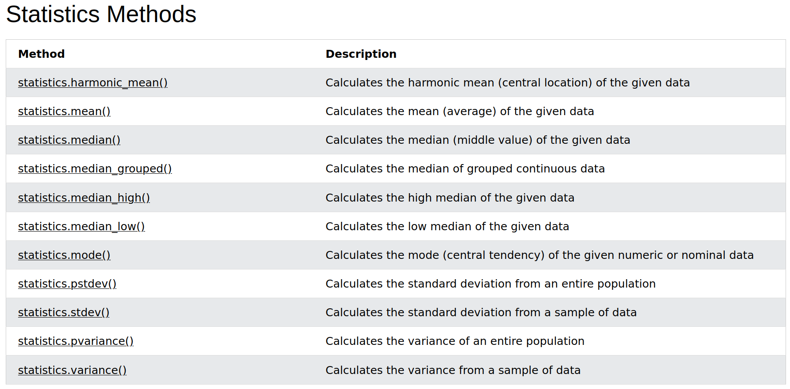

Documentation : https://docs.python.org/fr/3/library/statistics.html

```python
import statistics
```

|Indicateur|Méthode|
|---|---|
|Moyenne|statistics.mean(donnees)|
|Médiane|statistics.median(donnees)|
|Mode|statistics.mode(donnees)|
|Quantiles|statistics.quantiles(donnees)|
|Variance|statistics.pvariance(donnees) ou statistics.variance(donnees)|
|Écart type|statistics.pstdev(donnees) ou statistics.stdev(donnees)|
|Covariance|statistics.covariance()|
|Corrélation|statistics.correlation()|

Exemple de base :

```python
# cet exemple calcule et affiche une moyenne, médiane et mode en utilisant statistics
# tvaira (2023)

import statistics

# des données
donnees = [3, 5, 7, 8, 8, 9, 10, 11]

# calcule la moyenne
moyenne = statistics.mean(donnees)

# affiche la moyenne
print("La moyenne est : " + str(moyenne)) # 7.625

# calcule la médiane
mediane = statistics.median(donnees) # 8.0

# affiche la médiane
print("La médiane est : " + str(mediane))

# calcule le mode
mode = statistics.mode(donnees) # 8

# affiche la médiane
print("Le mode est : " + str(mode))
```

### JSON

[JSON](https://fr.wikipedia.org/wiki/JavaScript_Object_Notation) (_JavaScript Object Notation_) est un format de données textuelles dérivé de la notation des objets du langage JavaScript. Il permet de représenter de l’information structurée. Créé par Douglas Crockford entre 2002 et 2005, il est décrit par la RFC 7159 de l’IETF. Par définition, JSON est un format d’échange de données.

Site web : [json.org](https://json.org/json-fr.html)

Un document JSON ne comprend que deux types d’éléments structurels :

- des ensembles de paires « nom » (alias « clé ») / « valeur » : `"id": "1"`
- des listes de valeurs séparées par des virgules : `"nom": "VAIRA", "prenom": "Thierry"`.

Ces mêmes éléments représentent trois types de données :

- des objets : `{ ... }` ;
- des tableaux : `[ ... ]` ;
- des valeurs génériques de type tableau, objet, booléen, nombre, chaîne de caractères ou null (valeur vide).

Exemple de base :

```python
import json

d = {
'id': '1',
'nom': 'VAIRA',
'prenom': 'Thierry'
}

print(json.dumps(d))
print(json.dumps(data, indent=2))

# écriture dans un fichier
with open(fichier, 'w') as f:
    json.dump(d, f)

# lecture d'un fichier
with open(filename, 'r') as f:
    d = json.load(f)
```

### CSV

Le format [CSV](https://fr.wikipedia.org/wiki/Comma-separated_values) (_Comma-separated values_) est un format texte ouvert représentant des données tabulaires (cf. tableur) sous forme de valeurs séparées à l'origine par des virgules. Le séparateur n'est pas standardisé (virgule, point-virgule, etc.). Ce format est toutefois assez populaire parce qu'il est relativement facile à générer.

Exemple de base :

```python
# cet exemple affiche le contenu d'un fichier CSV

import csv

with open('./donnees/tmin-tmax-avignon-12-2024.csv', newline='') as fichier:
    contenu = csv.reader(fichier, delimiter=':', quoting=csv.QUOTE_NONE)
    # récupère la première ligne
    entete = next(contenu)
    print("Entête : ")
    print(entete)
    print("Contenu : ")
    for ligne in contenu:
        print(ligne)
```

Lire un fichier CSV avec [pandas](#pandas) :

```python
import pandas as pd

df = pd.read_csv("./donnees/tmin-tmax-avignon-12-2024.csv")
```

### hashlib

Le module [hashlib](https://docs.python.org/fr/3.8/library/hashlib.html) implémente une interface commune à différents [algorithmes de hachage](https://fr.wikipedia.org/wiki/Fonction_de_hachage) sécurisés : SHA1, SHA224, SHA256, SHA384, SHA512 et MD5 de RSA (défini par la RFC 1321).

Exemple :

```python
# La fonction intégrée hash()
message = "Hello wordl!"
valeur_hash = hash(message)
print("Message      : ", message)
print("Hash         : ", valeur_hash)

# Le module hashlib
import hashlib

hash_md5 = hashlib.md5(message.encode())
print("Message      : ", message)
print("Hash MD5     : ", hash_md5.hexdigest())

#hash_sha1 = hashlib.sha1(message.encode())
hash_sha1 = hashlib.sha1(b"Hello wordl!")
print("Message      : ", b"Hello wordl!")
print("Hash SHA1    : ", hash_sha1.hexdigest())

# hashlib.sha256(text.encode())
# hashlib.sha384(text.encode())
# hashlib.sha512(text.encode())

# Le module secrets https://docs.python.org/3/library/secrets.html
import secrets

sel = secrets.token_hex(16)

hash_sha256 = hashlib.sha256((sel + message).encode())
print("Message      : ", message)
print("Sel          : ", sel)
print("Hash SHA-256 : ", hash_sha256.hexdigest())
```

### codecs

- Avec le module Python [codecs](https://docs.python.org/3/library/codecs.html), on peut utiliser la fonction `encode()` (ou `decode()`) pour réaliser ce (dé)chiffrement :

Le module [codecs](https://docs.python.org/3/library/codecs.html)  fournit des fonctions pour le encodage et le décodage de données, telles que la conversion de texte entre différents ensembles de caractères. Il prend en charge une large gamme de codages standard.

> La plupart des [codecs](https://docs.python.org/3/library/codecs.html) fournis sont des encodages de caractères ([ISO/CEI 2022](https://fr.wikipedia.org/wiki/ISO/CEI_2022), [ISO/CEI 8859-15](https://fr.wikipedia.org/wiki/ISO/CEI_8859-15), [UTF-8](https://fr.wikipedia.org/wiki/UTF-8), ...) mais il y a aussi  [Base64](https://fr.wikipedia.org/wiki/Base64) avec le codec `base64` et [zlib](https://fr.wikipedia.org/wiki/Zlib) avec la compression [deflate](https://fr.wikipedia.org/wiki/Deflate) utilisés dans les fichiers au format [ZIP](https://fr.wikipedia.org/wiki/ZIP_(format_de_fichier)).

Exemple [UTF-8](https://fr.wikipedia.org/wiki/UTF-8) :

```python
import codecs

texte = 'mathématiques'
texte_encode = codecs.encode(texte, 'utf-8')
print(texte_encode) # b'math\xc3\xa9matiques'

texte_decode = codecs.decode(texte_encode, 'utf-8')
print(texte_decode) # 'mathématiques'
```

> [base64](https://fr.wikipedia.org/wiki/Base64) est un codage de l'information utilisant 64 caractères. L’intérêt de l'encodage [base64](https://fr.wikipedia.org/wiki/Base64) est de représenter des données binaires sous forme textuelle. Une transcription hexadécimale en ASCII des octets multiplierait la taille par deux, l'encodage en [base64](https://fr.wikipedia.org/wiki/Base64) permet de limiter cette augmentation. Il est principalement utilisé pour la transmission de messages (notamment dans les courriers électroniques) sur Internet. [base64](https://fr.wikipedia.org/wiki/Base64) n'est pas un système de chiffrement mais un codage d'information utilisant 64 caractères ASCII.

```python
import codecs

texte = b'Hello, World!'

texte_encode = codecs.encode(texte, 'base64')
print(texte_encode) # b'SGVsbG8sIFdvcmxkIQ=='
print(texte_encode.decode()) # 'SGVsbG8sIFdvcmxkIQ=='

texte_decode = codecs.decode(texte_encode, 'base64')
print(texte_decode) # b'Hello, World!'
print(texte_decode.decode()) # 'Hello, World!'
```

### base64

Le module [base64](https://docs.python.org/3/library/base64.html) fournit des fonctions permettant d'encoder des données binaires en caractères ASCII imprimables et de décoder ces encodages pour les reconvertir en données binaires. Cela inclut les encodages spécifiés dans la RFC 4648 ([base64](https://fr.wikipedia.org/wiki/Base64), Base32 et Base16).

```python
import base64

texte = b'Hello, World!'
texte_encode = base64.b64encode(texte)
print(texte_encode) # b'SGVsbG8sIFdvcmxkIQ=='
print(texte_encode.decode()) # 'SGVsbG8sIFdvcmxkIQ=='

texte_decode = base64.b64decode(texte_encode)
print(texte_decode) # b'Hello, World!'
print(texte_decode.decode()) # 'Hello, World!'
```

> Voir le module [codecs](#codecs).

## Bibliothèques

Cette partie présente les principales bibliothèques Python utilisées lors des séances de Co-enseignement de Mathématiques et Sciences Physiques (BTS CIEL).

> Voir aussi : https://www.tresfacile.net/top-75-meilleurs-modules-et-bibliotheques-python/

Importer un module :

```python
import numpy
```

Importer un module en lui donnant un alias :

```python
import numpy as np
```

Importer une fonction d'un module :

```python
from scipy.stats import linregress
```

Importer toutes les fonctions d'un module :

```python
from math import *
```

> Certaines fonctions portent le même nom dans des bibliothèques différentes. Il est donc préférable de ne pas utiliser `from <module> import *` mais plutôt `import <module>`.

Lister toutes les fonctions (méthodes) d’un module Python :

```python
>>> import math
>>> print(dir(math))
['__doc__', '__loader__', '__name__', '__package__', '__spec__', 'acos', 'acosh', 'asin', 'asinh', 'atan', 'atan2', 'atanh', 'ceil', 'comb', 'copysign', 'cos', 'cosh', 'degrees', 'dist', 'e', 'erf', 'erfc', 'exp', 'expm1', 'fabs', 'factorial', 'floor', 'fmod', 'frexp', 'fsum', 'gamma', 'gcd', 'hypot', 'inf', 'isclose', 'isfinite', 'isinf', 'isnan', 'isqrt', 'lcm', 'ldexp', 'lgamma', 'log', 'log10', 'log1p', 'log2', 'modf', 'nan', 'nextafter', 'perm', 'pi', 'pow', 'prod', 'radians', 'remainder', 'sin', 'sinh', 'sqrt', 'tan', 'tanh', 'tau', 'trunc', 'ulp']

>>> for i in dir(math): print(i)
... 
__doc__
__loader__
__name__
__package__
__spec__
acos
acosh
...

>>> help(math)
...
```

> Voir aussi : Le module `inspect`

### NumPy

[NumPy](https://numpy.org/) est une bibliothèque pour langage de programmation Python, destinée à manipuler des matrices ou tableaux multidimensionnels ainsi que des fonctions mathématiques opérant sur ces tableaux.

> Le langage de programmation Python n'a pas été conçu à l'origine pour le calcul numérique. Cependant, il a très tôt attiré l'attention de la communauté scientifique et technique. De nombreuses bibliothèques sont donc apparues pour accompagner ce domaine.

[Installation](https://numpy.org/install/) :

```sh
$ pip install numpy
```

[NumPy](https://numpy.org/) apporte la structure de données `ndarray` (tableaux multidimensionnels) à Python.


> Contrairement à la structure de [liste](https://docs.python.org/3/tutorial/datastructures.html) (`list`) de Python, cette structure de données n'est pas dynamique, et le type de ses éléments doit être homogène (de même type).

Pour créer un tableau à une dimension, on utilise la fonction [numpy.array()](https://numpy.org/doc/stable/reference/generated/numpy.array.html#numpy.array) en passant en argument une liste des nombres séparés par des virgules et entourés de crochets (`[` et `]`). Pour un tableau à deux dimension, on utilise une liste de listes grâce à des crochets imbriqués.

> Voir [Les tableaux à N dimensions](#les-tableaux-à-n-dimensions) et [les matrices](#les-matrices).

La fonction [numpy.shape()](https://numpy.org/doc/stable/reference/generated/numpy.shape.html#numpy.shape) retourne la géométrie du tableau.


La fonction [numpy.zeros(n)](https://numpy.org/doc/stable/reference/generated/numpy.zeros.html#numpy.zeros) crée un tableau à une dimension de _n_ zéros. Et [numpy.zeros((m, n))](https://numpy.org/doc/stable/reference/generated/numpy.zeros.html#numpy.zeros) crée un tableau à deux dimension de taille _m_ x _n_.

> Voir [Les tableaux à N dimensions](#les-tableaux-à-n-dimensions).

Exemple de base :

```python
import numpy as np

# un tableau vide
t = np.array([])

# un tableau à 1 dimension avec une liste de valeurs
a = np.array([0, 1, 2, 3])

# qu'est-ce ?
print(a) # affiche : [0 1 2 3]
print(type(a)) # affiche : <class 'numpy.ndarray'>

# accès aux éléments d'un tableau à 1 dimension
print(a[0]) # affiche : 0
print(type(a[0])) # affiche : <class 'numpy.int64'>
print(np.shape(a)) # affiche : (4,)

# un tableau à 2 dimensions
b = np.array([[0, 1, 2], [3, 4, 5]])

# qu'est-ce ?
print(b) # affiche : [[0 1 2]
         #            [3 4 5]]
print(type(b)) # affiche : <class 'numpy.ndarray'>

# accès aux éléments d'un tableau à 2 dimensions
print(b[0]) # affiche : [0 1 2]
print(b[0, 1]) # affiche : 1
print(np.shape(b)) # affiche : (2, 3)
```

Pour tracer correctement une fonction, il faut généralement un certain nombre de points que l'on peut générer avec [NumPy](https://numpy.org/) :

- La fonction [numpy.arange(debut, fin, pas)](https://numpy.org/doc/stable/reference/generated/numpy.arange.html#numpy.arange) retourne des valeurs régulièrement espacées par la taille du pas dans un intervalle donné.

- La fonction [numpy.linspace(linspace(debut, fin, n))](https://numpy.org/doc/stable/reference/generated/numpy.linspace.html#numpy.linspace) permet de créer une liste de _n_ nombres qui commencent à la valeur `debut` et s'arrête à la valeur `fin` et uniformément répartis.

Liens :

- https://numpy.org/devdocs/user/index.html
- https://numpy.org/numpy-tutorials/
- https://numpy.org/devdocs/reference/index.html

[NumPy](https://numpy.org/) pour les statistiques descriptives :

```python
import numpy as np
```

|Indicateur|Méthode|
|---|---|
|Moyenne|np.mean(donnees)|
|Médiane|np.median(donnees)|
|Quantiles|np.quantile(donnees)|
|Variance|np.var(donnees) ou np.var(donnees, ddof=1)|
|Écart type|np.std(donnees) ou np.std(donnees, ddof=1)|
|Covariance|np.cov()|
|Corrélation|np.correlate()|

> Le paramètre `ddof=1` (_delta degrees of freedom_) fixe le [degré de liberté](https://fr.wikipedia.org/wiki/Degr%C3%A9_de_libert%C3%A9_(statistiques)) sur 1 et permet le calcul avec $n - 1$ au dénominateur au lieu de $n$.

### Matplotlib

[Matplotlib](https://matplotlib.org/) est une bibliothèque du langage de programmation Python destinée à **tracer et visualiser des données sous forme de graphiques**.


> Elle peut être combinée avec les bibliothèques python de calcul scientifique [NumPy](https://numpy.org/) et [SciPy](https://scipy.org/).

[Installation](https://matplotlib.org/stable/users/installing/index.html) :

```sh
$ pip install matplotlib
```

Anatomie d’une figure Matplotlib :

Une figure Matplotlib peut contenir 1 ou plusieurs “zones de tracé” qui sont appelées “axes” dans la documentation.

> Le terme “axe” peut prêter à confusion en français puisque dans Matplotlib ceci correspond à une “sous-figure” alors que pour nous, les axes représentent plutôt les droites graduées d’un système de  coordonnées cartésiennes (axe des abscisses, axe des ordonnées). Ces dernières sont appelées _axis_ dans Matplotlib. Source : [BTS CIEL - C.Defrance - Python pour la science des données](https://www.lycee-benoit.tech/BTS/_defrance/ciel/d4/data-science/rfr-ds.html)

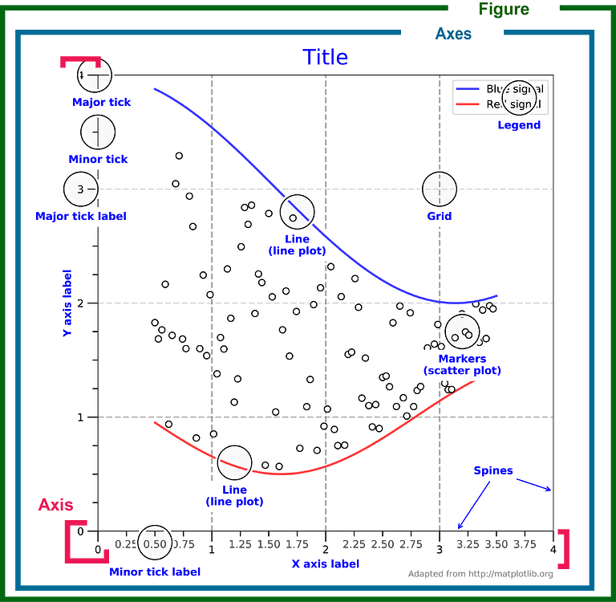

Exemple de base :

```python
# ce programme trace une courbe

import matplotlib.pyplot as plt
import numpy as np

# des données
x = np.linspace(0, 2 * np.pi, 200)
# np.sin est une "ufunc"
y = np.sin(x)

# un graphique

# style pyplot
plt.plot(x, y)

# style poo
#fig, ax = plt.subplots()
#ax.plot(x, y)

# affichage
plt.show()
```

On obtient :


> Les fonctions universelles (ou [ufunc](https://numpy.org/doc/2.1/reference/ufuncs.html)) sont des fonctions fournies par Numpy qui opèrent sur des tableaux _ndarray_ élément par élément. Une **ufunc** est une fonction (comme `np.sqrt`, `np.exp`, `np.log`, `np.sin`, `np.cos`, ...) qui applique une opération à chaque élément d'un tableau :
> ```python
> import numpy as np
> 
> a = np.array([1, 4, 9, 16])
> # np.sqrt est une "ufunc"
> print(np.sqrt(a))  # [1. 2. 3. 4.]
> 
> # L'opérateur ** est considéré comme une "ufunc" dans Numpy
> def f(x):
>     y = x ** 2
>     return y
> 
> b = np.array([1, 2, 3, 4])
> print(f(b))  # [ 1  4  9 16]
> ```

Exemple détaillé :

```python
# A partir de C. DEFRANCE ;)
import numpy as np
import matplotlib.pyplot as plt
import matplotlib.ticker as tck

# Définition de la fonction f(x)
def f(x) :
    y = x ** 2
    return y

# Domaine de définition de la fonction : [0...10[
x = np.linspace(0, 9, 100) # 100 valeurs de 0 à 9

# Appel de la fonction pour calculer le carré de toutes les
# valeurs contenues dans x
y = f(x)

# Création d'une figure Matplotlib
fig, ax = plt.subplots(layout="constrained")

# Configuration de la grille de la courbe :
# une graduation horizontale principale toutes les 1 unités
ax.xaxis.set_major_locator(tck.MultipleLocator(1))
# une graduation horizontale secondaire toutes les 0.5 unités
ax.xaxis.set_minor_locator(tck.MultipleLocator(0.5))
# une graduation verticale principale toutes les 10 unités
ax.yaxis.set_major_locator(tck.MultipleLocator(10))
# une graduation verticale secondaire toutes les 0.5 unités
ax.yaxis.set_minor_locator(tck.MultipleLocator(5))

# styles des grilles principales et secondaires
ax.grid(which='major', color='#CCCCCC', linestyle='--')
ax.grid(which='minor', color='#CCCCCC', linestyle=':')

# Tracé de la fonction (en bleu)
ax.plot(x, y, "blue")

# Configuration de la figure :
# libellé axe des abscisses
ax.set_xlabel("abscisses")
# libellé axe des ordonnées
ax.set_ylabel("ordonnées")
# titre de la figure
ax.set_title("Fonction carré")
# légende de la figure placée en haut à gauche
# avec le code LATEX
ax.legend([r'$ f(x) = x^{2}$' ],  loc='upper left')

# Affichage de la figure
plt.show()
```

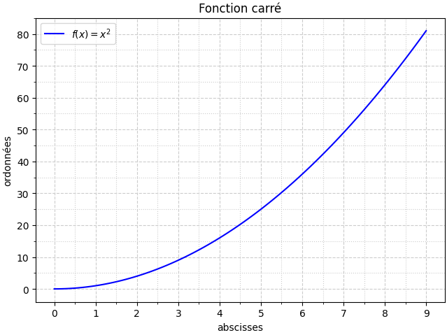

[Matplotlib](https://matplotlib.org/) permet de tracer différents types de courbes : [matplotlib.org/stable/plot_types/](https://matplotlib.org/stable/plot_types/index.html), par exemple :

| Fonction                   | Types de courbes                                         |
| -------------------------- | -------------------------------------------------------- |
| plot(x, y)                 | tracé de lignes, nuage de points                         |
| scatter(x, y)              | nuage de points                                          |
| bar(x, height)             | diagramme en bâtons                                      |
| hist(x)                    | histogramme                                              |
| boxplot(X)                 | boîte à moustache                                        |
| errorbar(x, y, yerr, xerr) | comme plot(x, y) mais avec des barres d'erreur associées |

Nuage de points :

Chaque couple de réels $(x_i,y_i)$ définit un point $M_{i}$ de coordonnées $(x_i,y_i)$. L'ensemble de ces points s'appelle un **nuage de points**.

On peut utiliser [scatter(x, y)](https://matplotlib.org/stable/api/_as_gen/matplotlib.pyplot.scatter.html) ou [plot(x, y, "r+")](https://matplotlib.org/stable/api/_as_gen/matplotlib.pyplot.plot.html) :

```python
# cet exemple trace la moyenne
# tvaira (2023)

import matplotlib.pyplot as plt
import numpy as np

# des données
y = np.array([3, 5, 7, 8, 8, 9, 10, 11])
x = np.arange(len(y))

# trace la valeur moyenne
plt.axhline(y=np.mean(y), color="red", linestyle="--")

# un graphique (nuage de points)
plt.scatter(x, y)
# ou :
#plt.plot(x, y, "r+")

# affichage
plt.show()
```

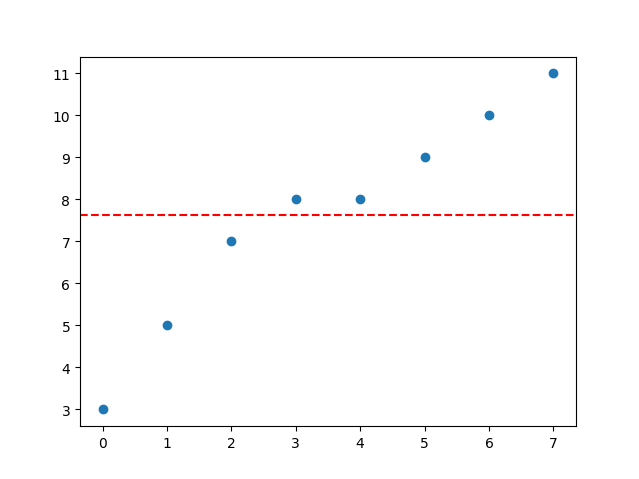

Diagramme en bâtons :

Le **diagramme en bâtons** permet de visualiser les effectifs (ou les fréquences) associés à chaque valeur de la variable.

Pour chaque valeur $x_{i}$ de la variable, on trace, au point d'abscisse $x_{i}$ un bâton vertical dont la hauteur est proportionnelle à l'effectif ${\displaystyle n_{i}}$ ou la fréquence ${\displaystyle f_{i}}$.

On utilise [bar(x, height)](https://matplotlib.org/stable/api/_as_gen/matplotlib.pyplot.bar.html) à la place de `plot()` pour obtenir un diagramme en bâtons.

```python
# cet exemple trace un diagramme en bâtons

import matplotlib.pyplot as plt
import numpy as np

# des données
langages = [ 'Python', 'C', 'C++', 'Java', 'C#', 'JavaScript' ]
popularite = [14.82, 12.08, 10.67, 8.92, 7.71, 2.91]

x = np.arange(len(langages))

# diagramme en bâtons
plt.bar(x, popularite)

# les labels des axes
plt.xlabel("Langages")
plt.xticks(x, langages)
plt.ylabel("Popularité")

# un titre
plt.title("Index TIOBE Oct 2023")

# affichage
plt.show()
```

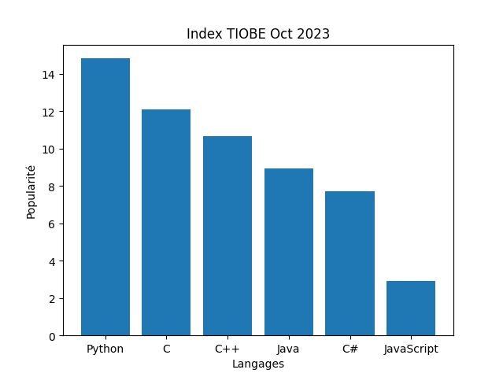

Histogramme :

L’[histogramme](https://fr.wikipedia.org/wiki/Histogramme) d’un échantillon est un diagramme constitué de barres verticales juxtaposées, chacune de ces barres représentant le nombre de termes de l’échantillon appartenant à une classe donnée. Pour représenter un histogramme d’un échantillon d’une loi réelle, on commence donc par répartir cet échantillon en classes, chacune de ces classes correspondant aux valeurs appartenant à un certain intervalle de R, et on représente cette classe par un rectangle vertical dont l’aire est proportionnelle à l’effectif de la classe. On normalise souvent ces aires de façon à ce que l’aire totale soit égale à 1.

Dans [Matplotlib](https://matplotlib.org/), [hist(x, bins=n)](https://matplotlib.org/stable/api/_as_gen/matplotlib.pyplot.hist.html) répartit les données de `x` dans _n_ intervalles (`bins`, groupes ou bacs) de largeur égale dans la plage. La fonction `hist()` de [Matplotlib](https://matplotlib.org/) utilise la fonction `numpy.histogram()` de [NumPy](https://numpy.org/doc/stable/reference/generated/numpy.histogram.html) puis `plot()` pour le tracé.

Nombre de classes (_bins_) :

- règle de Herbert Sturges (1926) qui, pour $N$ points de données répartis avec une distribution approximativement normale, suggère un nombre de classes $K$ obtenu avec la formule suivante :

${\displaystyle K=1+\log _{2}N\approx 1+{\frac {10}{3}}\log _{10}N}$

- règle dite de Rule :

${\displaystyle K=2\cdot N^{\frac {1}{3}}}$

- règle de la racine carrée :

${\displaystyle K={\sqrt {N}}}$

Boîte à moustache :

```python
import matplotlib.pyplot as plt
import numpy as np
import math

# loi normale (gaussienne)
x = np.random.normal(1, 1, size=1000)

# Nombre de classes : règle de la racine carrée
nb_classes = math.ceil(math.sqrt(len(x)))
print("Nombre de classes :", nb_classes)

# Tracé d'un histogramme
res = plt.hist(x, bins=nb_classes, color='gray', edgecolor='black')
#print(res)

# Configuration des grilles
plt.grid(which='major', color='black')

# Affichage
plt.show()
```

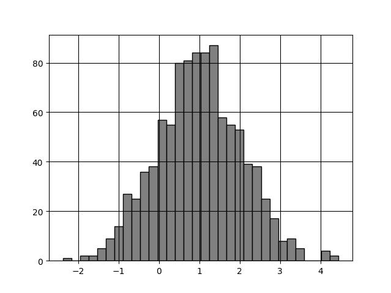

Tracé avec des barres d'erreur :

Pour tracer des données avec des barres d’erreur en Python, on peut utiliser la fonction `plt.errorbar()` de la bibliothèque [Matplotlib](https://matplotlib.org/) :

```python
import numpy as np
import matplotlib.pyplot as plt
import scipy.interpolate as interpolate

# des données
nb_mesures = x = np.arange(10)
y = np.random.normal(7.2, 0.1, size=len(nb_mesures))

# Tracé du nuage de points avec des barres d'incertitude
incertitude = np.std(y, ddof=1) / np.sqrt(len(y))
k = 2 # facteur d'élargissement de l'incertitude
plt.errorbar(x, y, yerr=k*incertitude, fmt='o', label='Mesures avec incertitude-type élargie (k=2)')
plt.hlines(np.mean(y), xmin=0, xmax=len(y)-1, color='orange', linestyle='--', label='Moyenne')
plt.title("Nuage de points avec barres d'incertitude")
plt.ylabel("pH")
plt.legend()
plt.grid(True)
plt.show()
```

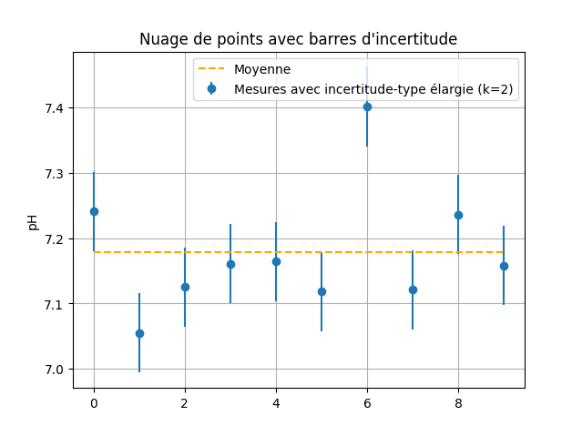

Tracé avec des _sliders_ (un exemple de [Python pour la physique-chimie](https://python.david-therincourt.fr/)) :

```python
# Modifier l'amplitude et/ou la période à l'aide de la souris avec des curseurs (sliders)
# David THERINCOURT
import numpy as np
import matplotlib.pyplot as plt
from matplotlib.widgets import Slider # Curseur
from math import pi

# Définition des paramètres initiaux
A = 4 # Amplitude initiale
T = 2 # Période initiale
dT = 0.1 # Pas de variation de la période

# Calculs
t = np.linspace(0, 10, 1000) # Tableau des valeurs du temps en seconde
s = A*np.cos(2*pi*t/T) # Tableau des valeurs calculées du signal sinusoïdal

# Tracé de la courbe
fig, ax = plt.subplots()
# Laisse une marge de 30% en bas de la zone de dessin pour placement des curseurs
plt.subplots_adjust( bottom=0.30)
trace, = plt.plot(t, s, lw=2)
plt.title("Evolution d'un signal périodique")
plt.xlabel("t (s)")
plt.ylabel("s")
plt.grid()

# Ajout des curseurs
ax_periode = plt.axes([0.25, 0.1, 0.65, 0.03],  facecolor='lightgoldenrodyellow')
ax_amp = plt.axes([0.25, 0.15, 0.65, 0.03], facecolor='lightgoldenrodyellow')
s_periode = Slider(ax_periode, 'Période (s)', 0.5, 10.0, valinit=T, valstep=dT)
s_amp = Slider(ax_amp, 'Amplitude', 0.1, 5, valinit=A)

def update(val):
    """ Fonction d'actualisation de la courbe """
    A = s_amp.val     # Récupération de la nouvelle amplitude
    T = s_periode.val # Récupération de la nouvelle période
    trace.set_ydata(A*np.cos(2*pi*t/T)) # Calcul du nouveau signal
    fig.canvas.draw_idle()     # Dessine la nouvelle courbe

# Lance la fonction update(val) si le curseur période
s_periode.on_changed(update)
# Lance la fonction update(val) si le curseur amplitude
s_amp.on_changed(update)
plt.show()
```

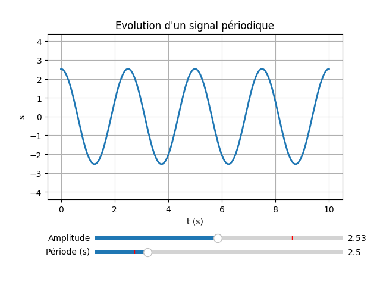

Animation (un exemple de [Python pour la physique-chimie](https://python.david-therincourt.fr/)) :

```python
# Cet exemple propose une animation de la propagation d'un onde sinusoïdal à partir de sa période temporelle T et de sa célérité c
# David THERINCOURT
import numpy as np
import matplotlib.pyplot as plt
import matplotlib.animation as animation
from math import pi

# paramètres de l'onde
T = 1 # (s) Période
c = 1 # (m/s) Célérité
A = 2 # (m) Amplitude

# paramètres du tracé
nb_t = 1000 # Nombre de valeurs de temps
Dt = 0.01 # Pas d'incrémentation du temps
nb_x = 200 # Nombre de valeurs de x
x_max = 4 # Valeur maximale de x

# valeurs de x
x = np.linspace(0, x_max, nb_x)

# Pause/Lecture de l'animation (clic de la souris sur la courbe)
pause = True
def onClick(event):
    global pause
    if pause:
        ani.event_source.stop()
        pause = False
    else:
        ani.event_source.start()
        pause = True

# Fonction d'animation : calcul du signal sinusoïdal
def actualise_onde(i):
    # Calcul de l'instant t en cours
    t = i * Dt
    # Calcul de l'onde en fonction de x  à l'instant t en cours
    y = A * np.sin(2*np.pi/T*(t - x/c))
    # Actualise le tracé de la courbe et l'affichage du temps
    courbe.set_data(x, y)
    text.set_text("t = " + str(round(t,1)) + " s")
    return courbe, text

# Initialise une figure et récupère le repère (ax)
fig, ax = plt.subplots()
# Activation de la gestion du clic de la souris
fig.canvas.mpl_connect('button_press_event', onClick)
# Zone de text pour afficher le temps
text = fig.text(0.5,0.90, "")
# Initialise un tracé vide et récupère la référence de la courbe
courbe, = plt.plot([],[])
plt.grid()
plt.xlim(0, x_max)
plt.xlabel("x (m)")
plt.ylim(-1.2*A, 1.2*A)
plt.ylabel("y (m)")
 # Active l'animation
ani = animation.FuncAnimation(fig, actualise_onde, frames=nb_t, interval=10, repeat=False)
plt.show()
```

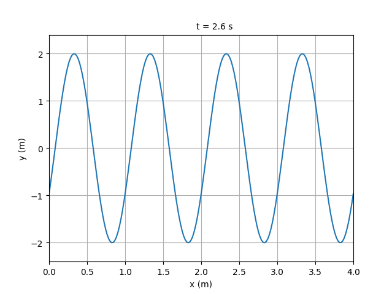

Liens :

- https://matplotlib.org/stable/users/index.html
- https://matplotlib.org/stable/gallery/index.html
- https://matplotlib.org/stable/api/index.html

> [Matplotlib](https://matplotlib.org/) dépend de la bibliothèque [NumPy](https://numpy.org/).

### Seaborn

[Seaborn](https://seaborn.pydata.org/) est une bibliothèque Python de visualisation de données basée sur [Matplotlib](https://matplotlib.org/).

Exemple :

```python
import matplotlib.pyplot as plt
import numpy as np
import seaborn as sns

# loi normale (gaussienne)
x = np.random.normal(1, 1, size=1000)
sns.histplot(x, kde=True)
plt.show()
```

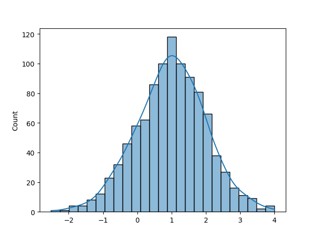

### SciPy

[SciPy](https://www.scipy.org/) est une bibliothèque de calcul scientifique basée sur [NumPy](https://numpy.org/). Elle offre des fonctionnalités supplémentaires, notamment [scipy.stats](https://docs.scipy.org/doc/scipy/reference/stats.html) pour l'analyse statistique.

[Installation](https://scipy.org/install/) :

```sh
$ pip install scipy
```

[SciPy](https://www.scipy.org/) et les statistiques descriptives :

|Indicateur|Méthode|
|---|---|
|Mode|scipy.stats.mode(donnees)|

[SciPy](https://www.scipy.org/) et les interpolations :

| Fonction                     | Description                                                                                  |
| ---------------------------- | -------------------------------------------------------------------------------------------- |
| scipy.stats.linregress()     | Calcule une régression linéaire par moindres carrés                                          |
| scipy.optimize.curve_fit()   | Utilise la méthode des moindres carrés non linéaires pour ajuster une fonction f aux données |
| scipy.interpolate.interp1d() | Utilise l'interpolation pour trouver la valeur de nouveaux points                            |

### pandas

[pandas](https://pandas.pydata.org/pandas-docs/stable/) est une bibliothèque de calcul numérique basée sur [NumPy](https://numpy.org/). Elle offre des fonctionnalités intéressantes dans la gestion des données étiquetées (1D) avec [Series](https://pandas.pydata.org/pandas-docs/stable/reference/api/pandas.Series.html) et des données 2D avec [DataFrame](https://pandas.pydata.org/pandas-docs/stable/reference/api/pandas.DataFrame.html).

[Installation](https://matplotlib.org/stable/users/installing/index.html) :

```sh
$ pip install pandas
```

Exemple de base :

```python
import pandas as pd

# Une série de données
serie = pd.Series([3, 5, 7, 8, 8, 9, 10, 11])
serie.describe()

# Charger les données depuis le fichier CSV
donnees = pd.read_csv('donnees/nba.csv')

# calcule la moyenne
moyenne = donnees['Salary'].mean()

# affiche la moyenne
print("La moyenne des salaires en NBA est : " + str(moyenne))

# calcule la médiane
mediane = donnees['Salary'].median()

# affiche la médiane
print("La médiane des salaires en NBA est : " + str(mediane))

...
```

|Indicateur|Méthode|
|---|---|
|Moyenne|donnees['X'].mean()|
|Médiane|donnees['X'].median()|
|Variance|donnees['X'].var()|
|Écart type|donnees['X'].std()|

Exemple :

```python
# cet exemple affiche les informations d'une DataFrame pandas
# tvaira (2023)

import pandas as pd

# Charge les données depuis le fichier CSV
ventesJusDeFruit = pd.read_csv("donnees/ventes-jus-fruit.csv", sep=';')
ventesJusDeFruit.set_index('Année', inplace=True)

# ou :
ventes = pd.DataFrame({'1er': [170, 250, 290, 450, 320],
                  '2e': [300, 410, 460, 550, 600],
                  '3e': [610, 790, 890, 1100, 1260],
                  '4e': [120, 190, 250, 270, 280]},
                  index=['2011', '2012', '2013', '2014', '2015'])

#print(ventes.info())
#print(ventes.describe())
print("DataFrame :")
print(ventes)
print()

print("values :")
print(type(ventes.values))
print(ventes.values)
print()

print("Dimension : " + str(ventes.ndim) + "D")
print("Dimension : " + str(ventes.shape))
nbAnnees, nbTrimestres = ventes.shape
print("nbAnnees = " + str(nbAnnees))
print("nbTrimestres = " + str(nbTrimestres))
print()

print("index (row index) :")
# index
print(ventes.index)
# row index
print(ventes.axes[0])
print("keys (column index) :")
# keys
print(ventes.keys())
# column index
print(ventes.axes[1])
print("axes :")
# axes
print(ventes.axes)
print()

print("Series (colonne) :")
print(type(ventes["1er"]))
print(ventes['1er'])
print()

print("Series (ligne) :")
print(type(ventes.loc['2011']))
print(ventes.loc['2011'])
print(ventes.iloc[0])
print("nbValeurs = " + str(ventes.iloc[0].count()))
print()

print("ligne(s)/colonne(s) :")
print(ventes.loc['2011': '2015'])
print(ventes.loc['2011': '2015', '1er'])
print()

print("valeur :")
print(ventes.loc['2011']['4e'])
print(ventes.iloc[0,3])
print()
```

Exemple tableau croisé dynamique :

```python
# cet exemple affiche les informations statistiques d'une série en utilisant pandas
# tvaira (2023)

import pandas as pd

# Une série de données
serie = pd.Series([3, 5, 7, 8, 8, 9, 10, 11])
print(serie.describe())
print()

# Charger les données depuis le fichier CSV
donnees = pd.read_csv('https://github.com/laxmimerit/All-CSV-ML-Data-Files-Download/raw/refs/heads/master/nba.csv')
#print(donnees.info())
#print(donnees.describe())
#print()

# calcule la moyenne
moyenne = donnees['Salary'].mean()

# affiche la moyenne
print("La moyenne des salaires en NBA est : " + str(moyenne) + " dollars US\n")

# calcule la médiane
mediane = donnees['Salary'].median()

# affiche la médiane
print("La médiane des salaires en NBA est : " + str(mediane) + " dollars US\n")

# trier des données
donneesTriees = donnees.sort_values(by = ["Height", "Salary"], ascending = [True, False])
print("Les 5 plus petits joueurs triés par salaire :")
print(donneesTriees.head())
print()

donneesTriees = donnees.sort_values(by = ["Salary", "Height"], ascending = [False, True])
print("Les 5 plus gros salaires triés par taille (du plus petit au plus grand) :")
print(donneesTriees.head())
print()

print("Les joueurs dont le salaire est inférieur ou égal à 100000 dollars US :")
print(donnees[donnees["Salary"] <= 100000])
print()

# tableau croisé dynamique
nbaSalairesParPosition = pd.pivot_table(donnees, index=['Position'], values=['Salary'],aggfunc=('mean', 'median'))
print("Salaires par position :")
print(nbaSalairesParPosition)
#print(nbaSalairesParPosition.describe())
print()

nbaMoyennesSalairesParPosition = pd.pivot_table(donnees, index=['Position'], values=['Salary'])
print("Moyenne des salaires par position (tri descendant) :")
print(nbaMoyennesSalairesParPosition.sort_values(by = ["Salary"], ascending = [False]))
```

### Sympy

[SymPy](https://www.sympy.org/fr/) est une bibliothèque Python open-source déstinée au calcul symbolique. Elle offre de nombreux sous-modules pour effectuer une variété de tâches mathématiques : calcul intégral, matrices, physiques, ...

Lien : https://www.sympy.org/fr/

Installation : `pip install sympy`

On utilise SymPy notamment pour manipuler des expressions mathématiques.

Les symboles :

```python
>>> import sympy as sy

# un symbole
>>> x = sy.Symbol('x')
>>> x
x

# un symbole ou ... plusieurs
>>> x = symbols('x')
>>> x
x

>>> x, y, z = symbols('x y z')
>>> x, y, z
( x , y , z )
```

Les expressions :

```python
import sympy as sy

# définition de symboles
x = sy.symbols('x') # sy.Symbol('x')
y = sy.symbols('y') # sy.Symbol('y')

# définition d'une expression
expression = x*sy.sin(y) + y*sy.sin(x)
print(expression) # x*sin(y) + y*sin(x)

# développement d'une expression
expr = (x - y)**3
print(expr) # (x - y)**3
print(expr.expand()) # x**3 - 3*x**2*y + 3*x*y**2 - y**3

# simplification d'une expression
expr1 = (x + 1)**2
expr2 = x**2 + 2*x + 1
expr3 = sy.simplify( expr2 - expr1 )
print(expr2, " - ", expr1, " = ", expr3 ) # x**2 + 2*x + 1  -  (x + 1)**2  =  0

# substitution d'un symbole par une valeur
expr = x**2 + x + 3
print(expr) # x**2 + x + 3
print("expr(x=1) = ", expr.subs(x, 1)) # expr(x=1) =  5

# transformation d'une expression en une fonction
expr = x**2 + 3*x + 5
print(expr) # x**2 + 3*x + 5
f = sy.lambdify(x , expr)
print("f(0) = " , f(0)) # affiche: f(0) =  5

# factorisation d'une expression
expr = x**2 - 2*x + 1 # un polynôme
print(expr) # x**2 - 2*x + 1
fact = sy.factor(expr)
print(fact) # (x - 1)**2

# résolution de l'équation : x**2 - 3 = 0
# x**2 = 3
expr = x**2
print(expr, " = 3") # x**2 = 3
print(sy.solve(sy.Eq(expr , 3))) # [-sqrt(3), sqrt(3)]

# définition d'un système d'équations
# 2*x + y  = 3
# x - 3*y  = -2
eq1 = sy.Eq(2*x + y, 3)
eq2 = sy.Eq(x - 3*y, -2)
print(eq1, eq2) # Eq(2*x + y, 3) Eq(x - 3*y, -2)

# résolution d'un système d'équations
solution = sy.solve( (eq1 , eq2) , (x,y) )
print( solution ) # {x: 1, y: 1}
```

### OpenCV

[OpenCV](https://pypi.org/project/opencv-python/) (_Open Computer Vision_) est une bibliothèque spécialisée dans le traitement d'images.

[Installation](https://www.geeksforgeeks.org/how-to-install-opencv-for-python-in-linux/?ref=lbp) :

```sh
$ pip install opencv-python
$ pip install --upgrade numpy
```

Exemple de base : le drapeau français

> On prend volontairement une image simple composée seulement de 6 pixels (3 x 2). Les couleurs en RGB pour le drapeau français seront choisies judicieusement : le "rouge" sera codé acec la seule composante R soit la valeur `0xFF0000` et le "bleu" avec `0x112233` ce qui permettra d'identifier plus facilement l'ordre RGB.

```python
import cv2

# l'image
fichierImage = "images/drapeau-france.png"

# ouverture avec opencv
img = cv2.imread(fichierImage)

# grille de lecture
ordreCouleurs = ('b','g','r')
print("Ordre des couleurs : " + str(ordreCouleurs))

# affiche les valeurs des pixels
print("Pixels :\n" + str(img))

# affiche l'image
print("Appuyez sur une touche pour quitter")
cv2.imshow("image", img)

# attendre la fermeture (appui sur une touche pour quitter)
cv2.waitKey(0)

# fermeture et libération des ressources
cv2.destroyAllWindows()
```

On obtient :

```sh
Ordre des couleurs : ('b', 'g', 'r')
Pixels :
[[[ 51  34  17]
  [255 255 255]
  [  0   0 255]]

 [[ 51  34  17]
  [255 255 255]
  [  0   0 255]]]
Appuyez sur une touche pour quitter
```

### Pillow (PIL)

[PIL](https://pypi.org/project/Pillow/) (_Python Imaging Library_) est une bibliothèque de traitement d’image disponible à partir du _package_ `Pillow`.

[Installation](https://pillow.readthedocs.io/en/latest/installation.html) de la bibliothèque PIL :

```sh
$ pip install Pillow
```

```python
# coding: utf-8

# Python3 pour Windows : https://www.python.org/downloads/
# PIL (Python Imaging Library) (Pillow fork)
# Installation : pip install Pillow
# Documentation : https://pillow.readthedocs.io/en/stable/

print("ACTIVITÉ 1")

# PIL est une bibliothèque de traitement d'image
import PIL;
print("PIL version ", PIL.__version__)

# on importe le module Image de la bibliothèque PIL
# le module Image fournit une classe du même nom qui sera utilisée pour représenter une image.
from PIL import Image

# cf. https://fr.wikipedia.org/wiki/Lenna

# Image est une classe (c'est un type Image)
# img est un objet de la classe Image
# la création d'un objet se nomme l'instanciation
# open() est une fonction (méthode) de la classe Image qui permet de charger un fichier image
img = Image.open("./images/lena.jpg");
# format, size et mode sont des données (attributs) de la classe Image
print(img.format, img.size, img.mode)
# exemple : les modes courants sont "L" (luminance) pour les images en niveaux de gris, "RGB" pour les images en couleurs vraies et "CMYK" pour les images pour l'imprimerie (quadrichromie)
print("Fichier :", img.filename)

print("2. Calculez le nombre de pixels de cette image.")

# Affichage des dimensions de l'image
print("L =", img.width, "x H =", img.height)
# Calcul et Affichage du nombre de pixels de l'image
print("Nombre de pixels =", (img.width*img.height) , "pixels")

# Affichage de l'image
img.show()

# resize() est une fonction (méthode) de la classe Image qui permet de modifier la taille d'une image et d'en obtenir une nouvelle
# im2 est un objet de la classe Image
im2 = img.resize((228,192))
# save() est une fonction (méthode) de la classe Image qui sauvegarder l'image dans un fichier (ici, l'extension précisera le format de l'image)
im2.save("./images/lena_228x192.png")
print(im2.format, im2.size, im2.mode)
print("Nombre de pixels =", "L =", im2.width, "x H =", im2.height, "=", (im2.width*im2.height) , "pixels")
im2.show()

# size est un tuple (les tuples sont des séquences qu'on ne pourra plus modifier)
size = (144,96) = les parenthèses ne sont pas obligatoires
width, height = size
print(size, width, height)

im3 = img.resize(size)
im3.save("./images/lena_144x96.png")
print(im3.format, im3.size, im3.mode)
print("Nombre de pixels =", "L =", im3.width, "x H =", im3.height, "=", (im3.width*im3.height) , "pixels")
im3.show()

import tkinter as tk = en python 3
ecran = tk.Tk()
#print(ecran.winfo_screen()) = nom de l'écran

print("1. Calculez la résolution de l'écran en pixels par centimètre, puis en ppp.")

# Résolution = Nombre de pixels en largeur / Largeur
w, h = ecran.winfo_screenwidth(), ecran.winfo_screenheight()
print("Ecran = %s pixels x %s pixels" % (w, h))

# Taille de l'écran
print("Ecran = %s mm x %s mm" % (ecran.winfo_screenmmwidth(), ecran.winfo_screenmmheight()))
print("Ecran = %s cm x %s cm" % (ecran.winfo_screenmmwidth()/10, ecran.winfo_screenmmheight()/10))

# Résolution (en pixels par cm)
ppc_w = (w / (ecran.winfo_screenmmwidth()/10))
ppc_h = (h / (ecran.winfo_screenmmheight()/10))
print("Résolution = %.2f x %.2f pixels par cm" % (ppc_w, ppc_h))

# Résolution ppp (en pixels par pouce) ou ppi (pixel per inch)
ppi_w = (w / (ecran.winfo_screenmmwidth()/10)) * 2.54
ppi_h = (h / (ecran.winfo_screenmmheight()/10)) * 2.54
print("Résolution = %.2f x %.2f ppp (pixels par pouce)" % (ppi_w, ppi_h))

print("2. Calculez pour l'image Femme_288x192.png la taille exacte en centimètres qui doit s'afficher à l'écran de l'ordinateur.")

print("Taille : L =", im2.width, "pixels x H =", im2.height, "pixels")
print("Taille : L = %.2f" % (im2.width/ppc_w), "cm x H = %.2f" % (im2.height/ppc_h), "cm")

# Bonus :
depth = ecran.winfo_screendepth() = retourne le nombre de bits par pixel
print("Nombre de bits par pixel =", depth) = RGB 24 bits = R8 + G8 + B8

# cf. le format BMP (sans compression)
print("Taille : L =", (im2.width*depth), "bits x H =", (im2.height*depth), "bits", "=", ((im2.width*im2.height*depth)), "bits")
print("Taille : L =", (im2.width*depth), "bits x H =", (im2.height*depth), "bits", "=", ((im2.width*im2.height*depth))/8, "octets")
# https://fr.wikipedia.org/wiki/Préfixe_binaire
print("Taille :", (((im2.width*im2.height*depth))/8)/1024, " Kio (kibi)")
print("Taille :", (((im2.width*im2.height*depth))/8)/1000, " ko (kilo)")
#print("Taille :", (((im2.width*im2.height*depth))/8)/1024/1024, " Mio (mebi)")
#print("Taille :", (((im2.width*im2.height*depth))/8)/1000/1000, " Mo (mega)")
```

Exemple de base : les informations d'une image

```python
import matplotlib.pyplot as plt
import PIL
import numpy as np
import os

# importation du module Image de la bibliothèque PIL
from PIL import Image

# l'images
fichierImage = "images/drapeau-france.png"

# gestion du fichier
fichier = os.path.basename(fichierImage)
path = os.path.dirname(fichierImage)
nomFichier = os.path.splitext(fichier)[0]
extension = os.path.splitext(fichier)[1]

# une image
image = Image.open(path + "/" + nomFichier + extension);

# affiche les informations sur l'image
print("Fichier :", image.filename)
print("Format :", image.format)
print("Mode :", image.mode)
print("Taille :", image.size)
print("L =", image.width, "x H =", image.height)
print("Nombre de pixels =", (image.width * image.height) , "pixels")

# grille de lecture
ordreCouleurs = ('r','g','b', 'a')
print("Ordre des couleurs : " + str(ordreCouleurs))

# récupération des pixels
pixels = np.array(image)
# affiche les valeurs des pixels
print("Pixels :\n" + str(pixels))

# récupération des couleurs
couleurs = image.getcolors(image.width * image.height)
print("Couleurs :\n" + str(couleurs))

def hexencode(rgb):
    r=rgb[0]
    g=rgb[1]
    b=rgb[2]
    return '#%02x%02x%02x' % (r,g,b)

for idx, c in enumerate(couleurs):
     print(str(c[0]) + " x " + hexencode(c[1]))

# fermeture des fichiers
image.close()
```

On obtient :

```sh
Fichier : images/drapeau-france.png
Format : PNG
Mode : RGBA
Taille : (3, 2)
L = 3 x H = 2
Nombre de pixels = 6 pixels
Ordre des couleurs : ('r', 'g', 'b', 'a')
Pixels :
[[[ 17  34  51 255]
  [255 255 255 255]
  [255   0   0 255]]

 [[ 17  34  51 255]
  [255 255 255 255]
  [255   0   0 255]]]
Couleur :
[(2, (255, 255, 255, 255)), (2, (17, 34, 51, 255)), (2, (255, 0, 0, 255))]
2 x #ffffff
2 x #112233
2 x #ff0000
```

Exemple de base : niveau de gris

> Il est possible de transformer une image en couleurs RGB en niveaux de gris. Pour obtenir le niveau de gris d'un pixel couleur, il faut mélanger les composantes RGB. La CIE (Commission Internationale de l'Eclairage) a produit la norme 709 qui fournit la formule suivant : `gris = 0.2125 * R + 0.7154 * G + 0.0721 * B`

```python
import matplotlib.pyplot as plt
import PIL
import numpy as np
import os

# importation du module Image de la bibliothèque PIL
from PIL import Image, ImageOps

fichierImage = "images/tux.png"

# gestion du fichier
fichier = os.path.basename(fichierImage)
path = os.path.dirname(fichierImage)
nomFichier = os.path.splitext(fichier)[0]
extension = os.path.splitext(fichier)[1]

# une image
image = Image.open(path + "/" + nomFichier + extension);

# affiche les informations sur l'image
print("Fichier :", image.filename)
print("Format :", image.format)
print("Mode :", image.mode)
print("Taille :", image.size)
print("L =", image.width, "x H =", image.height)
print("Nombre de pixels =", (image.width * image.height) , "pixels")

# affichage de l'image
# en RGB
#plt.imshow(image)
# en niveau de gris
#plt.imshow(ImageOps.grayscale(image), cmap=plt.get_cmap('gray'))
plt.imshow(image.convert('LA'), cmap=plt.get_cmap('gray'), vmin=0, vmax=1)
plt.show()

# récupération des pixels et conversion en niveau de gris
pixels = np.array([])
for x in range(image.width):
    for y in range(image.height):
        # récupére les valeurs du pixel
        pixel = image.getpixel((x,y))
        # calcul du poids de chaque composante du gris dans le pixel (CIE709)
        gris = int(0.2125 * pixel[0] + 0.7154 * pixel[1] + 0.0721 * pixel[2])
        pixels = np.append(pixels, gris)

# affiche les valeurs des pixels en niveau de gris
print("Pixels :\n" + str(pixels))
print("Nb pixels : " + str(len(pixels)))

# histogramme
plt.title("Histogramme")
plt.xlabel("Valeur")
plt.ylabel("Nb pixels")
plt.hist(pixels, bins=256)
plt.show()

# fermeture des fichiers
image.close()
```

> Evidemment, les bibliothèques de traitement d'images proposent des fonctions pour convertir une image en niveau de gris : `cv2.cvtColor(image, cv2.COLOR_BGR2GRAY)` avec OpenCV, `image.convert('LA')` avec PIL, etc.

Les opérations précédentes peuvent être réalisées directement avec la bibliothèque PIL (_Python Imaging Library_) !

La fonction `transpose()` permet de retourner ou faire pivoter par incréments de 90 degrés une image :

```python
from PIL import Image

im = Image.open("image.jpg")

# Retourner l'image de gauche à droite
im_flipped = im.transpose(method=Image.FLIP_LEFT_RIGHT)

# autres : Image.FLIP_TOP_BOTTOM, Image.ROTATE_90, Image.ROTATE_180, Image.ROTATE_270, Image.TRANSPOSE ou Image.TRANSVERSE
```

D'autre part, le https://pillow.readthedocs.io/en/stable/reference/ImageFilter.html[module ImageFilter] fournit un ensemble suivant de filtres d'amélioration d'image prédéfinis;

La méthode `Image.filter()` :

```python
from PIL import Image, ImageFilter

im = Image.open("image.jpg")

im1 = im.filter(ImageFilter.BLUR)

im_blurred = im.filter(ImageFilter.GaussianBlur(radius=5))
im_blurred.show()

# Filtre médian
im2 = im.filter(ImageFilter.MedianFilter(3)) # 3 x 3
im2.show()

# autres : CONTOUR, DETAIL, EDGE_ENHANCE, EDGE_ENHANCE_MORE, EMBOSS, FIND_EDGES, SHARPEN, SMOOTH et SMOOTH_MORE
```

### Graphviz

[Graphviz](https://graphviz.org/) est un logiciel open source de visualisation de graphes. La visualisation de graphes est un moyen de représenter des informations structurelles sous forme de diagrammes de graphes et de réseaux abstraits. Il a des applications importantes dans les domaines des réseaux, de la bioinformatique, de l'ingénierie logicielle, de la conception de bases de données et de sites Web, de l'apprentissage automatique et des interfaces visuelles pour d'autres domaines techniques.

Le [langage DOT](https://graphviz.org/doc/info/lang.html) est un langage de description de graphe dans un format texte. Il fait partie de l'ensemble d'outils open source [Graphviz](https://graphviz.org/) créés par les laboratoires de recherche d'AT&T.

Les fichiers textes contenant une description de graphe portent l'extension `.dot` ou `.gv`.

- Graphe non orienté :

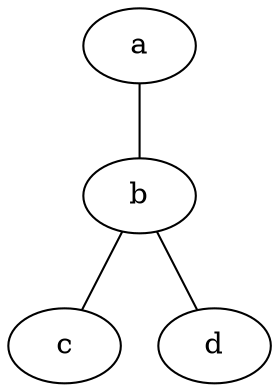


- Graphe orienté :

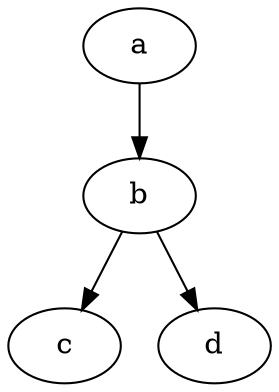


Sous GNU/Linux Ubuntu :

```sh
$ sudo apt install graphviz
```

Tests [CLI](https://graphviz.org/doc/info/command.html) :

```sh
$ echo 'graph { a -- b -- c; b -- d; }' | dot -Tsvg > graphe-non-oriente.svg

$ echo 'digraph { a -> b -> c; b -> d; }' | dot -Tsvg > graphe-oriente.svg
```

Tests en ligne : [https://graph.flyte.org/](https://graph.flyte.org/)

- [Graphe non orienté](https://graph.flyte.org/#graph%20mon_graphe%20%7B%0A%20%20%20%20%20a%20--%20b%20--%20c%3B%0A%20%20%20%20%20b%20--%20d%3B%0A%7D)
- [Graphe orienté](https://graph.flyte.org/#digraph%20mon_graphe%20%7B%0A%20%20%20%20%20a%20-%3E%20b%20-%3E%20c%3B%0A%20%20%20%20%20b%20-%3E%20d%3B%0A%7D)

Extensions VS Code :

- [Graphviz Preview](https://marketplace.visualstudio.com/items?itemName=EFanZh.graphviz-preview) : Preview Graphviz (DOT) files
- etc.

Pour le langage Python : [https://graphviz.org/resources/](https://graphviz.org/resources/)

- [graphviz](https://pypi.org/project/graphviz/) : creation and rendering of graph descriptions in the DOT language
- [Pydot](https://pypi.org/project/pydot/) : a Python interface to Graphviz (Windows compatible)
- [PyGraphviz](https://pypi.org/project/pygraphviz/) : a Python interface to Graphviz similar to NetworkX
- [GvGen](https://github.com/stricaud/gvgen) : a Python class to generate dot files

Exemple avec [graphviz](https://pypi.org/project/graphviz/) :

```sh
$ pip install graphviz
```

```python
#!/usr/bin/env python
# encoding: utf-8

import graphviz

g = graphviz.Digraph('G', filename='graphe-oriente.gv')

g.edge('a', 'b')
g.edge('b', 'c')
g.edge('b', 'd')

print(g.source)

g.view()
```

> De nombreux algorithmes de la [théorie des graphes](https://fr.wikipedia.org/wiki/Th%C3%A9orie_des_graphes) sont implementés dans le module [NetworkX](https://networkx.org/). cf. [Tutoriel](https://networkx.org/documentation/stable/tutorial.html)

### Streamlit

[Streamlit](https://streamlit.io/) transforme des scripts Python en applications Web interactives.

Liens :

- https://streamlit.io/
- https://pypi.org/project/streamlit/

Installation : `pip install streamlit`

Exemple :

```python
# save this as streamlit_app.py
import streamlit as st
import matplotlib.pyplot as plt
import numpy as np
import seaborn as sns

x = st.slider("Choisir une valeur pour x", 0, 1000, 100)
st.write("Valeur choisie", x)

st.write("Distribution de ", x, " valeurs aléatoires suivant une loi normale (gaussienne)")
arr = np.random.normal(1, 1, size=x)
fig, ax = plt.subplots()
#ax.hist(arr, bins=20)
sns.histplot(arr, kde=True, ax=ax)
st.pyplot(fig)
```

Exécution :

```sh
$ streamlit run streamlit_app.py

  You can now view your Streamlit app in your browser.

  Local URL: http://localhost:8501
```

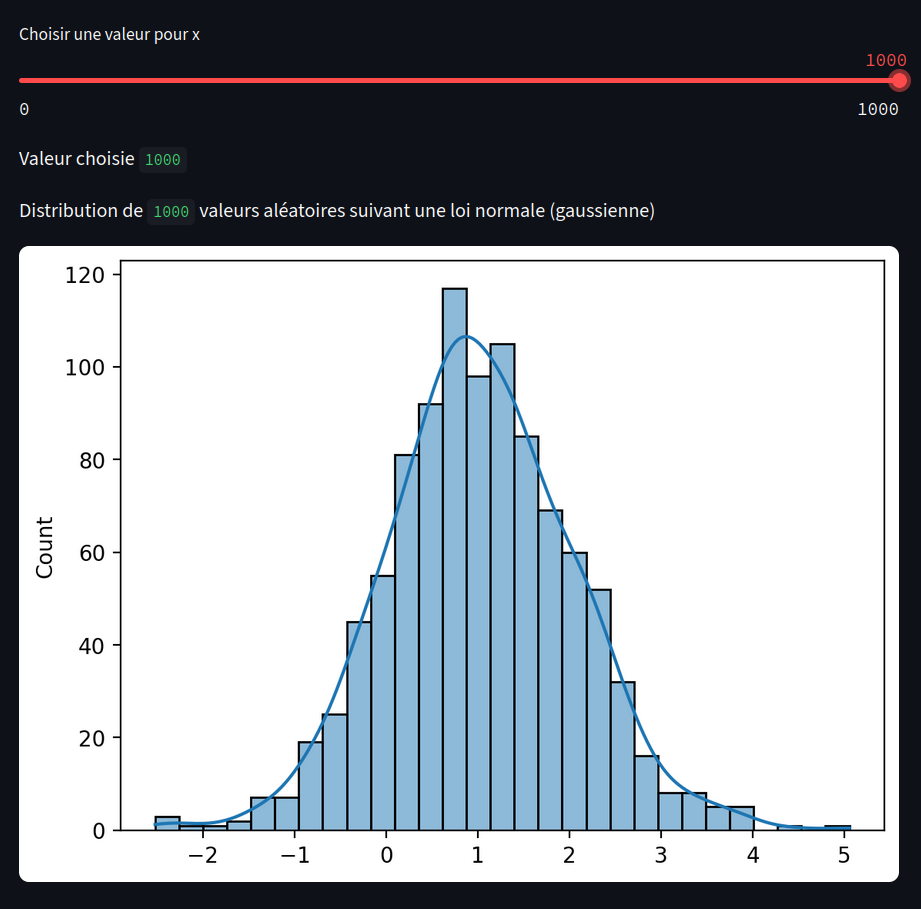

### Flask

[Flask](https://pypi.org/project/Flask/) est un _framework_ pour créer des applications web.

Installation : `pip install Flask`

Exemple :

```python
# save this as app.py
from flask import Flask

app = Flask(__name__)

@app.route("/")
def hello():
    return "Hello, World!"
```

Exécution :

```sh
$ flask run
  * Running on http://127.0.0.1:5000/ (Press CTRL+C to quit)
```

> Documentation : https://flask.palletsprojects.com/

### Interfaces graphiques (GUI)

Python possède plusieurs modules disponibles pour la création de logiciels avec une interface graphique.

Le plus répandu est [Tkinter](https://docs.python.org/3/library/tkinter.html).

```python
from tkinter import *
from tkinter import ttk

root = Tk()
frm = ttk.Frame(root, padding=10)
frm.grid()
ttk.Label(frm, text="Hello World!").grid(column=0, row=0)
ttk.Button(frm, text="Quit", command=root.destroy).grid(column=1, row=0)
root.mainloop()
```

Il existe aussi des adaptations de bibliothèques d'interface graphique :

- [wxPython](https://wxpython.org/) pour _wxWidgets_
- [PyGTK](https://www.pygtk.org/) pour GTK
- [PyQt](https://riverbankcomputing.com/) et [PySide](http://www.pyside.org/) pour [Qt](https://doc.qt.io/qtforpython-6/)

Il existe des adaptations de bibliothèques pour les jeux :

- [Pygame](http://www.pyga.me/) pour [SDL](https://www.libsdl.org/)
- [PySFML](https://www.sfml-dev.org/tutorials/1.6/start-python-fr.php) pour [SFML](https://www.sfml-dev.org/tutorials/3.0/)
- [Pyglet](http://pyglet.org/)

Installation de [Pyglet](http://pyglet.org/) : `pip install --upgrade --user pyglet`

```python
import pyglet

window = pyglet.window.Window(640, 480, caption="Hello world!")

pyglet.app.run()
```

## Tester les exercices de GitHub Classroom

Installation de [pytest](https://docs.pytest.org/en/stable/) :

```sh
$ pip install -U pytest

$ pytest --version
pytest 8.3.4
```

Tester localement un exercice :

```sh
$ export PYTHONPATH='./exercices/' && pytest ./tests/test_exerciceX.py
```

Noter un exercice (Github) :

```sh
$ git add --all
$ git commit -m "<type-message>"
$ git push
```

Voir les résultats dans l'onglet **Actions**.

---
&#x1f12f; BTS LaSalle Avignon - 2025 - [Thierry Vaira](thierry.vaira@gmail.com)
